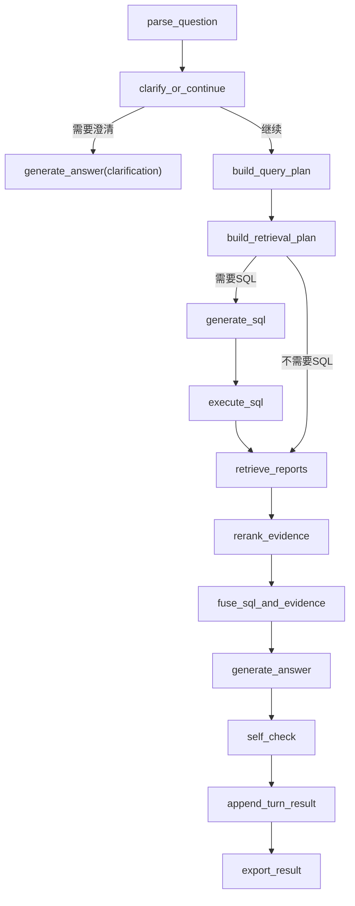

# 任务三 LangGraph 使用说明

## 1. 模块定位

[src/task3_langgraph](/Users/yijiawen/YJW/竞赛/泰迪杯/最终选题/src/task3_langgraph) 是当前任务三的主架构实现。

当前目标不是立刻把任务三调到最优，而是先把这条主链路搭起来并进入小样本调优：

- 读取附件 6 问题
- 多轮问题解析
- 澄清门控
- SQL 查询计划
- 研报检索计划
- 数据库查询
- 研报检索
- 证据重排（rerank 骨架）
- SQL 与证据融合
- 自检
- 导出 `result_3.xlsx`

这版仍是 `LLM-only` 工作流，但检索部分已经推进到：

- 元数据检索
- PDF 正文抽取与 chunk 清单
- OpenAI 兼容 embedding 调用
- 真正的 `FAISS`
- `metadata / vector / hybrid` 检索模式

当前任务三已经完成过一轮 4 题小样本回答冒烟：

- `B2002`
- `B2003`
- `B2005`
- `B2008`

当前结论是：

1. 任务三主链已经跑通
2. 数据准备层已经可用
3. 当前主要问题转为澄清门控、SQL 与证据融合质量、`references` 精度和后续图表链接入
4. `rerank` 现已升级为“专门 reranker 优先，LLM/分数回退兜底”
5. 当前全量知识库已可用：
   - `总 chunk = 12856`
   - `已建向量索引 chunk = 12856`
   - `index_status = ready`

附件 5 中这两个信息表会在三个阶段用到：

- 建库阶段：
  - `个股_研报信息.xlsx`
  - `行业_研报信息.xlsx`
  - 用来做 chunk metadata 标准化，补齐公司、行业、股票代码、机构、发布日期、评级、研究员、市场等字段。
- 检索阶段：
  - 用来做 `source_type=stock/industry` 区分，以及按公司/行业/机构/评级等元数据过滤与打分。
- 回答阶段：
  - 用来给证据引用补齐标题、机构、日期、来源类型等信息，方便最终输出参考依据。

另外，附件 5 中的 [字段说明.xlsx](/Users/yijiawen/YJW/竞赛/泰迪杯/最终选题/正式数据/附件5：研报数据/字段说明.xlsx) 现在已经正式接进建库流程，用来解释：

- `个股_研报信息.xlsx` 的字段含义
- `行业_研报信息.xlsx` 的字段含义

并把这些字段说明同步写入 chunk 构建与 metadata 标准化逻辑中。

---

## 2. 当前结构

- 入口：
  - 回答入口：[run_task3_langgraph.py](/Users/yijiawen/YJW/竞赛/泰迪杯/最终选题/run_task3_langgraph.py)
  - 建库入口：[run_task3_index.py](/Users/yijiawen/YJW/竞赛/泰迪杯/最终选题/run_task3_index.py)
- 配置：
  - [src/task3_langgraph/config/settings.py](/Users/yijiawen/YJW/竞赛/泰迪杯/最终选题/src/task3_langgraph/config/settings.py)
- 状态：
  - [src/task3_langgraph/schemas/state.py](/Users/yijiawen/YJW/竞赛/泰迪杯/最终选题/src/task3_langgraph/schemas/state.py)
- 问题模型：
  - [src/task3_langgraph/schemas/models.py](/Users/yijiawen/YJW/竞赛/泰迪杯/最终选题/src/task3_langgraph/schemas/models.py)
- 解析：
  - [src/task3_langgraph/services/parser.py](/Users/yijiawen/YJW/竞赛/泰迪杯/最终选题/src/task3_langgraph/services/parser.py)
- LLM：
  - [src/task3_langgraph/services/llm.py](/Users/yijiawen/YJW/竞赛/泰迪杯/最终选题/src/task3_langgraph/services/llm.py)
- Prompt：
  - [src/task3_langgraph/prompts](/Users/yijiawen/YJW/竞赛/泰迪杯/最终选题/src/task3_langgraph/prompts)
- 运行时：
  - [src/task3_langgraph/tools/runtime.py](/Users/yijiawen/YJW/竞赛/泰迪杯/最终选题/src/task3_langgraph/tools/runtime.py)
- metadata 标准化：
  - [src/task3_langgraph/tools/report_metadata.py](/Users/yijiawen/YJW/竞赛/泰迪杯/最终选题/src/task3_langgraph/tools/report_metadata.py)
- 检索骨架：
  - [src/task3_langgraph/tools/retrieval.py](/Users/yijiawen/YJW/竞赛/泰迪杯/最终选题/src/task3_langgraph/tools/retrieval.py)
- 切片清单骨架：
  - [src/task3_langgraph/tools/report_parser.py](/Users/yijiawen/YJW/竞赛/泰迪杯/最终选题/src/task3_langgraph/tools/report_parser.py)
- 向量存储骨架：
  - [src/task3_langgraph/tools/vector_store.py](/Users/yijiawen/YJW/竞赛/泰迪杯/最终选题/src/task3_langgraph/tools/vector_store.py)
- 节点：
  - [src/task3_langgraph/nodes/workflow.py](/Users/yijiawen/YJW/竞赛/泰迪杯/最终选题/src/task3_langgraph/nodes/workflow.py)
- 图编排：
  - [src/task3_langgraph/graph/builder.py](/Users/yijiawen/YJW/竞赛/泰迪杯/最终选题/src/task3_langgraph/graph/builder.py)
  - [src/task3_langgraph/graph/runner.py](/Users/yijiawen/YJW/竞赛/泰迪杯/最终选题/src/task3_langgraph/graph/runner.py)

---

## 3. 当前工作流



---

## 4. 当前检索实现

现在已经支持三层骨架：

1. 元数据检索
   - 基于标题、公司名、行业名、主题词打分
2. 正文 chunk 清单
   - 通过 PDF 正文抽取生成 report chunk manifest
3. FAISS 向量检索
   - 若配置 `TASK3_EMBEDDING_*`，会生成 dense vector index 骨架
   - 当前默认使用 `FAISS IndexFlatIP` 做 dense 检索
   - 若环境里没有 `faiss`，会自动回退到本地精确余弦检索

还没有正式接入：

- 更细粒度标题/章节切片
- 更强的 evidence fusion

当前已经有：

- `retrieve_reports`
- `rerank_evidence`
- `fuse_sql_and_evidence`

其中 `rerank` 当前策略是：
- 若配置 `TASK3_RERANK_*`，优先调用专门 reranker 模型
- 当前推荐：`BAAI/bge-reranker-v2-m3`
- 若 reranker 不可用，再回退到 LLM rerank
- 若 LLM 也失败，再回退到召回分数排序

chunk 当前已经升级成“标题/段落优先”的策略：

- 先按 PDF 页抽正文
- 再按标题、自然段、图表/表格标题做结构化预切分
- 正文优先按段落组合成 chunk
- 只有正文过长时，才退回字符窗口切片
- 默认 `chunk_size_chars=900`
- 默认 `chunk_overlap_chars=150`

并且每个 chunk 都会带上由附件 5 研报信息表标准化后的 metadata，例如：

- `source_type`
- `title`
- `company`
- `stock_code`
- `industry`
- `publish_date`
- `organization`
- `organization_full_name`
- `organization_short_name`
- `rating_current`
- `rating_previous`
- `researchers`
- `page_start`
- `page_end`
- `section_title`
- `subsection_title`
- `chunk_type`
- `figure_table_refs`

其中：

- `chunk_type`
  - `body`
  - `visual_caption`
  - `metadata_fallback`
- `figure_table_refs`
  - 用来记录 chunk 中命中的 `图8 / 图表8 / 表3` 这类引用标号
  - 方便后续回答阶段生成附件 7 里 `references.paper_image`

当前不是先转 markdown 再切，而是：

- 直接从 PDF 抽纯文本
- 用结构化规则识别标题/段落/图表标题
- 再做 chunk 切分

这样做的原因是：

- PDF 转 markdown 在中文研报里不一定稳定
- 当前先保证结构化切块和引用元信息稳定
- 后续如有需要，仍可以继续升级成 markdown/版面感知切分

为了避免 chunk metadata 过于臃肿，当前实现采用了“两层结构”：

- chunk 上只保留核心检索字段和 `metadata_ref`
- 完整研报信息与字段说明单独写入：
  - `artifacts/chunks/report_metadata_lookup.json`

后续如果回答阶段需要更多字段，可以通过 `metadata_ref` 再回查完整 metadata，而不必把所有字段重复塞进每个 chunk。

当前任务三已经完成了真实小样本问答冒烟，所以现在的链路不只是“检索骨架”，而是：

- `retrieve_reports`
- `rerank_evidence`
- `fuse_sql_and_evidence`
- `generate_answer`
- `self_check`

都已经能在小样本上跑通。

---

## 4.1 当前提速策略

任务三目前已经开始做“在尽量不牺牲质量前提下的提速”，当前已经落地的策略有：

1. **问题解析与计划合并**
   - 原来分开的 `build_query_plan` 与 `build_retrieval_plan`，现在优先由一个统一 planning 节点一起产出。
   - 这样每题可少一次 LLM 往返。

2. **SQL 缓存**
   - 同一条 SQL 再次执行时，直接复用本地缓存结果。
   - 缓存目录：
     - `outputs/task3_langgraph/artifacts/sql_cache`

3. **retrieval 缓存**
   - 同一个 retrieval plan 会直接复用已检索结果。
   - 缓存目录：
     - `outputs/task3_langgraph/artifacts/retrieval_cache`

4. **rerank 触发条件收紧**
   - 命中证据很少、题目明显简单、或 metadata 结果已经足够明确时，会直接跳过 rerank。
   - debug 中会显示：
     - `rerank_strategy=skipped_fast_path`

5. **self_check 触发条件收紧**
   - 简单事实题、小结果集题不会强制跑自检。
   - debug 中会显示：
     - `self_check_skipped_fast_path`

6. **rewrite 只在高风险失败时触发**
   - 不是所有 `self_check.pass=false` 都会自动重写
   - 当前只对：
     - 指标混淆
     - 数字不一致
     - 聚合值误映射
     - 关键遗漏
     这类高风险问题触发 rewrite

当前要明确一点：
- 这些提速策略已经接入
- 但复杂多轮题仍然可能较慢
- 例如 `B2003` 单题实测仍约 `181s`

所以任务三当前状态是：
- **已经开始提速**
- **但还没有完全进入最终比赛速度**

下一步仍要继续观察：
- 哪些题能稳定走 fast path
- 哪些题仍然卡在复杂融合 / 自检 / rewrite

---

## 5. 输出

默认输出到：

- [outputs/task3_langgraph](/Users/yijiawen/YJW/竞赛/泰迪杯/最终选题/outputs/task3_langgraph)

主要产物：

- `result_3.xlsx`
- `artifacts/task3_langgraph_results.csv`
- `artifacts/task3_langgraph_summary.json`
- `artifacts/debug/*.json`
- `artifacts/retrieval/*.json`
- `artifacts/chunks/report_chunks.json`
- `artifacts/chunks/report_metadata_lookup.json`
- `artifacts/vector_store/index_meta.json`
- `artifacts/vector_store/index.faiss`

当前导出字段为：

- `编号`
- `问题`
- `SQL 查询语句`
- `参考依据`
- `回答`

---

## 6. 运行方式

### 6.1 配置

优先读取：

- `configs/task3_llm.env`

如果不存在，会回退读取：

- `configs/task2_llm.env`

模板文件：

- [configs/task3_llm.env.example](/Users/yijiawen/YJW/竞赛/泰迪杯/最终选题/configs/task3_llm.env.example)

可额外配置 embedding：

- `TASK3_EMBEDDING_BASE_URL`
- `TASK3_EMBEDDING_API_KEY`
- `TASK3_EMBEDDING_MODEL`

也可额外配置专门 reranker：

- `TASK3_RERANK_BASE_URL`
- `TASK3_RERANK_API_KEY`
- `TASK3_RERANK_MODEL`

推荐配置：

```env
TASK3_RERANK_BASE_URL=https://api.siliconflow.cn/v1
TASK3_RERANK_API_KEY=YOUR_API_KEY
TASK3_RERANK_MODEL=BAAI/bge-reranker-v2-m3
```

在正式建库前，建议先单独验证 embedding 接口是否可用。  
当前项目的 embedding client 会请求：

- `POST {TASK3_EMBEDDING_BASE_URL}/embeddings`

所以 `TASK3_EMBEDDING_BASE_URL` 应填写根地址，例如：

- `https://api.siliconflow.cn/v1`

不要直接写成：

- `https://api.siliconflow.cn/v1/embeddings`

最小测试命令：

```bash
set -a
source configs/task3_llm.env
set +a

curl --request POST \
  --url "${TASK3_EMBEDDING_BASE_URL}/embeddings" \
  --header "Authorization: Bearer ${TASK3_EMBEDDING_API_KEY}" \
  --header "Content-Type: application/json" \
  --data "{
    \"model\": \"${TASK3_EMBEDDING_MODEL}\",
    \"input\": [\"请分析云南白药盈利改善的驱动因素\"]
  }"
```

如果返回中出现：

- `"object": "list"`
- `"data": [...]`
- `"embedding": [...]`

就说明 embedding 接口已经打通。

如果配置了 embedding：

- 第一次运行会构建 chunk manifest
- 然后尝试构建 `FAISS` 向量索引
- 构建结果会写到：
  - `artifacts/chunks/report_chunks.json`
  - `artifacts/chunks/report_metadata_lookup.json`
  - `artifacts/vector_store/index_meta.json`
  - `artifacts/vector_store/index.faiss`

### 6.2 回答入口

单题运行：

```bash
python run_task3_langgraph.py --question-id B2001
```
### 6.3 建库入口

只构建 / 检查索引：

```bash
python run_task3_index.py
```

建库时会打印更直观的批次进度，例如：

```text
[index] batch=3 completed=24/200 remaining=176 next_resume=24
```

启动时还会先打印摘要，例如：

```text
[index-summary] 个股研报=160 | 行业研报=313 | 个股 chunk=160 | 行业 chunk=313 | 正文抽取成功研报=420 | metadata fallback 研报=53 | 总 chunk=473 | 已完成=24 | 剩余=449 | 当前索引状态=partial | 下次续跑起点=24
```

输出 JSON 里也会带：

- `completed_chunk_count`
- `remaining_chunk_count`
- `next_resume_index`
- `index_progress`

小样本索引冒烟：

```bash
python run_task3_index.py --index-limit 200
```

如果担心限流，建议用更稳的断点续建方式：

```bash
python run_task3_index.py \
  --index-limit 500 \
  --embedding-batch-size 8 \
  --embedding-batch-pause-seconds 2 \
  --embedding-max-batches-per-run 10
```

这样会：

- 小批次请求 embedding
- 每批成功后落盘
- 中断后下次继续未完成部分

检索冒烟测试：

```bash
python run_task3_index.py \
  --retrieval-smoke-question "请分析云南白药盈利改善的驱动因素" \
  --retrieval-mode hybrid \
  --index-limit 200
```

### 6.3 当前推荐的任务三调试顺序

1. 先建库或续跑索引
   - `python run_task3_index.py --index-limit 20`
2. 再做检索冒烟
   - `python run_task3_index.py --retrieval-smoke-question "..." --retrieval-mode hybrid --index-limit 20`
3. 再做小样本回答冒烟
   - `python run_task3_langgraph.py --question-ids B2002,B2003,B2005,B2008`
4. 最后再扩大样本

### 6.3.1 当前推荐的正式建库命令

当前项目内已经统一采用：

```bash
rm -rf outputs/task3_langgraph
python run_task3_index.py \
  --embedding-batch-size 64 \
  --embedding-batch-pause-seconds 1
```

如果之后又改了 chunk 规则、metadata 规则、embedding 模型或 FAISS 结构，建议仍然按这个命令重建知识库。

### 6.4 按题号批量运行

```bash
python run_task3_langgraph.py --question-ids B2001,B2002,B2003
```

### 6.5 抽样运行

```bash
python run_task3_langgraph.py --sample-limit 10 --sample-seed 7
```

### 6.6 全量运行

```bash
python run_task3_langgraph.py
```

---

## 7. 当前边界

这版已经不是“纯骨架”，而是“可用第一版”，但还不是最终效果版。

当前边界包括：

1. 检索现在已经能走 `bge-m3 + FAISS IndexFlatIP` 主链，但还没有做更强的 ANN、IVF、PQ 或更精细的检索调优。
2. 当前 chunk 已经来自 PDF 正文并做了结构化切分，但仍不是最终的章节级/语义级切片。
3. rerank 已有骨架，但还不是最终版强 reranker。
4. 证据融合和自检仍是第一版 Prompt 逻辑。
5. 任务三图表链路尚未正式接入，所以像 `B2003` 这类要求可视化的问题目前 `image` 可能仍为空。
6. `references` 所需的 `paper_path / text / paper_image` 能力基础已经在数据准备层开始准备，但最终引用筛选和拼装仍在后续回答阶段完成。
7. 当前小样本中，`B2008` 这类完整筛选问题仍可能触发不必要的澄清；`B2005` 这类题仍可能出现利润/营收语义混淆，说明效果调优还在进行中。

另外，若 `bge-m3` 出现 `429 Too Many Requests`：

- 可以减小 `--embedding-batch-size`
- 增大 `--embedding-batch-pause-seconds`
- 限制 `--embedding-max-batches-per-run`
- 多次重复运行完成断点续建

所以它的定位是：

- 先把任务三框架立起来
- 后面等任务一、任务二进一步稳定后，再逐步补真实检索和调优

---

## 8. 推荐的后续顺序

1. 继续稳住任务一、任务二数据底座
2. 持续做任务三 3 到 5 题小样本回归
3. 优先调：
   - 澄清门控
   - SQL 与证据融合
   - `references`
4. 之后再考虑接任务三图表链与更强 rerank
