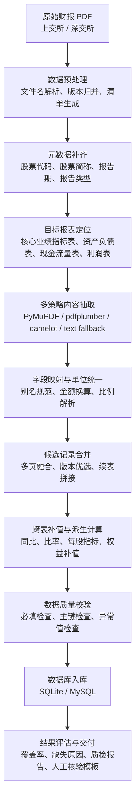

# 任务一技术路线图

## 一、技术路线说明

任务一的目标在于将上市公司财务报告 PDF 中的非结构化、半结构化信息转换为可直接入库和后续问答使用的结构化财务数据。考虑到财报存在版式差异大、字段命名不统一、单位口径不一致、跨页续表频繁等问题，本文构建了“数据预处理 - 多策略抽取 - 标准化转换 - 跨表融合 - 规则校验 - 数据入库 - 质量评估”的总体技术路线。该路线既强调抽取精度，也兼顾结果的可解释性和可复核性，为后续任务二的自然语言问数和任务三的研报增强分析提供统一、稳定的数据底座。

## 二、任务一技术路线图

图 1 给出了任务一的整体技术路线。

图 1 任务一技术路线图

## 三、技术路线分层设计

### 3.1 数据预处理层

数据预处理层主要负责对上交所和深交所财报目录进行统一整理。针对深交所数据中存在的“摘要”“全文”“更正后”“更新后”等版本差异，系统优先保留更正版文档，并生成标准化清单文件；针对上交所数据，则根据股票代码、公告日期和随机标识解析文件名信息。该层的输出是后续流水线统一读取的 `manifest` 文件。

### 3.2 多策略抽取层

考虑到单一 PDF 工具难以适应复杂财报版式，本文在抽取层采用多策略组合方案。首先利用 `PyMuPDF` 完成页面级定位，并依据报表标题关键词确定目标页范围；随后利用 `pdfplumber` 进行跨页表格抽取，以增强对财务报表续页结构的适应性；若表格对象抽取效果不理想，则进一步启用 `fitz.combined_text` 进行文本级兜底抽取，并对拆行标签和续行数值进行重构；在必要情况下，使用 `camelot` 作为备用结构化抽取工具。通过该策略组合，系统能够显著降低因表格断裂、文字换行或版式差异造成的抽取失败。

### 3.3 标准化转换层

标准化转换层负责将抽取到的原始文本或表格结果映射到统一的数据库字段体系。具体而言，系统首先依据字段别名词典完成项目名称规范化，然后对金额字段进行单位统一，将 `元`、`万元`、`亿元` 等不同口径转换到统一尺度，并对百分比、百分点、括号负数等特殊格式进行规范解析。该层输出的是结构一致、字段统一的候选记录。

### 3.4 融合增强层

由于同一份财报在不同页面可能产生多条候选记录，系统进一步设计了候选合并机制，按照 `stock_code + report_period + report_year + table_name` 对记录进行聚合，并优先保留字段更完整、来源更稳定的结果。在此基础上，进一步利用跨表关系开展补值与派生计算，例如通过资产总计与负债合计推导所有者权益，通过利润表、现金流量表结果补齐核心业绩指标表中的毛利率、净利率、每股净资产和每股经营现金流等字段，从而提升整体字段覆盖率。

### 3.5 质量控制层

质量控制层包括规则校验与结果评估两部分。规则校验侧重于必填字段检查、业务主键重复检查和比例异常值检测；结果评估则重点输出字段覆盖率、缺失字段统计、缺失原因分类、人工抽样核验模板以及论文实验结果表。该设计使系统不仅能够“抽取数据”，还能够“解释结果”，从而为竞赛论文和答辩展示提供直接支撑。

## 四、关键工具与框架

表 1 给出了任务一实现过程中使用的主要工具与对应作用。

| 模块 | 工具 / 框架 | 主要作用 |
| --- | --- | --- |
| PDF 解析 | `PyMuPDF` | 页面读取、报表定位、文本与表格区域获取 |
| 跨页表格抽取 | `pdfplumber` | 处理续页表和复杂财务报表 |
| 备用表格抽取 | `camelot` | 在结构化表格场景下补充抽取能力 |
| 数据处理 | `pandas` | 表格清洗、统计分析、结果导出 |
| 数据库管理 | `SQLAlchemy` | SQLite / MySQL 建表与写入 |
| Excel 输出 | `openpyxl` | 生成人工核验工作簿 |
| 命令行管理 | `argparse` | 提供统一运行入口 |

表 1 任务一关键工具与功能对应关系

## 五、技术路线特点与优势

1. 采用多策略抽取机制，提升了对复杂财报版式的适应能力。
2. 通过跨表补值和派生计算，有效提高了核心指标字段的覆盖率。
3. 引入缺失原因判定机制，将“源文档未披露”和“抽取失败”区分开来，增强了结果解释性。
4. 在输出数据库结果的同时，同步生成质量评估和论文材料，便于后续任务衔接与竞赛交付。

## 六、与后续任务的衔接

任务一不仅要完成结构化抽取本身，更承担着后续任务的数据底座功能。任务二中的自然语言问数依赖于任务一形成的四张结构化业务表；任务三中的数据核验、归因分析和问答增强，也需要以任务一输出的标准化财务数据为基础。因此，任务一技术路线的设计重点不仅在于抽取精度，还在于结果的一致性、可追溯性与可扩展性。
