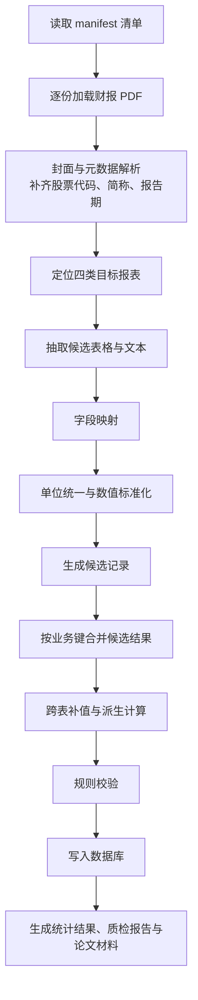
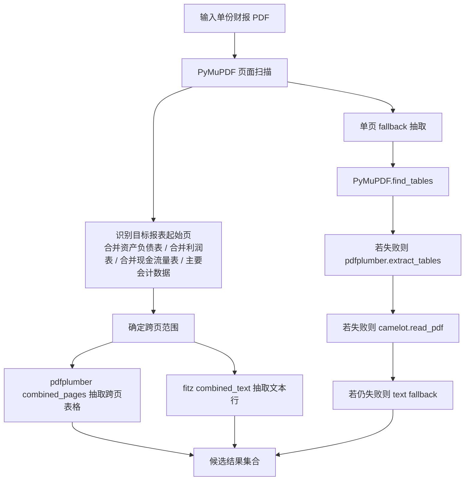
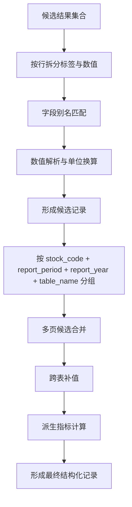
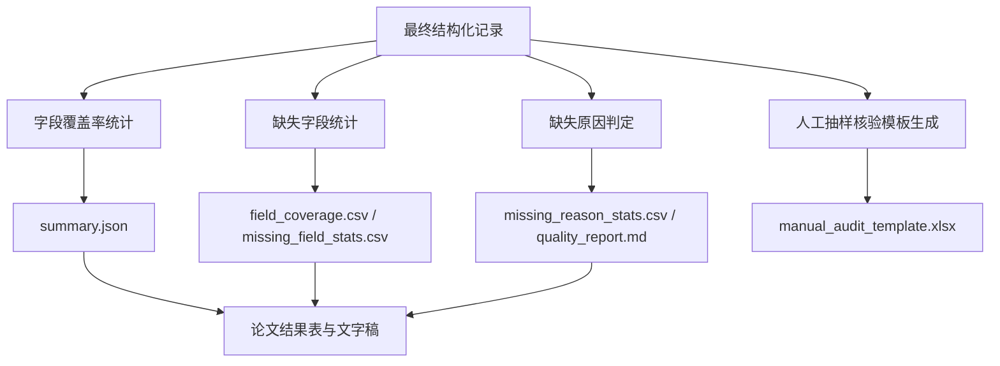

# 任务一算法流程图

## 一、算法流程说明

任务一的算法设计围绕“从财报 PDF 到结构化数据库”的完整链路展开。为提高抽取结果的稳定性与可复用性，算法并非仅依赖单一表格识别步骤，而是分为报表定位、候选抽取、字段映射、结果融合、规则校验和质量评估等多个阶段。通过分阶段处理，可以在保证抽取覆盖率的同时，提高对复杂版式和长尾字段的适应能力。

## 二、总体算法流程

图 2 展示了任务一的总体算法流程。

图 2 任务一总体算法流程

## 三、抽取算法细化流程

为增强对复杂报表场景的适应能力，本文对抽取部分采用了分层 fallback 策略。图 3 给出了抽取算法的细化流程。

图 3 任务一抽取算法流程

## 四、转换与融合流程

抽取得到的候选结果仍存在字段名称不统一、单位口径不同以及多页重复候选等问题，因此需要进一步执行转换与融合操作。图 4 给出了该过程。

图 4 任务一转换与融合流程

## 五、质量评估流程

为了使抽取结果具备可解释性与可复核性，本文进一步设计了质量评估流程，如图 5 所示。

图 5 任务一质量评估流程

## 六、算法步骤概括

从实现角度看，任务一算法可以概括为以下步骤：

1. 对原始财报目录进行标准化预处理，生成统一清单文件。
2. 对每份财报解析封面信息和元数据，补齐股票代码、简称、报告期等基础信息。
3. 依据报表标题关键词定位核心业绩指标表、资产负债表、现金流量表和利润表。
4. 采用多策略抽取方式获取候选表格与候选文本结果。
5. 通过字段别名词典和单位标准化规则，将原始结果转换为目标字段。
6. 对同一业务键下的多候选结果进行融合与优选。
7. 通过跨表补值与派生计算提高整体字段覆盖率。
8. 对最终结果进行规则校验并写入数据库。
9. 输出覆盖率统计、缺失原因分析、人工核验模板以及论文实验材料。

## 七、算法流程的意义

该流程的优势在于将“抽取正确率”“数据一致性”和“结果可解释性”纳入同一框架之中。与仅输出抽取结果的方案相比，本文方法更适合数学建模竞赛场景下的完整任务交付，也更便于与后续自然语言问数和多源增强分析模块进行衔接。
