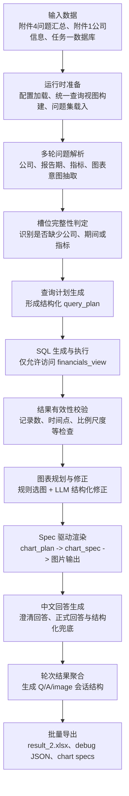
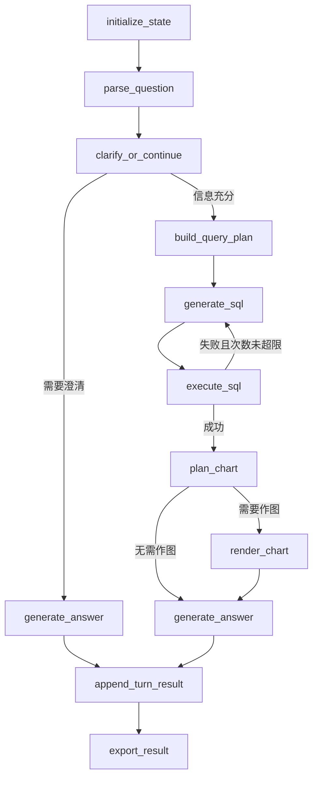

# 任务二技术路线图

## 一、技术路线说明

任务二要求系统围绕附件 4 中的自然语言问题，自动完成财务数据查询、文本回答生成与图表输出，并按照赛题要求导出统一格式的结果文件。该任务既涉及多轮问答中的上下文承接，也涉及自然语言到结构化查询的映射、查询结果有效性控制以及图像文件生成，因此本质上属于一个集“问题理解、结构化查询、结果组织、可视化表达”于一体的复合型智能问数任务。

为提高系统稳定性与可解释性，本文采用 LangGraph 构建显式状态机，将任务二组织为“问题解析 - 槽位判定 - 查询规划 - SQL 生成与修复 - 结果校验 - 图表规划与渲染 - 回答生成 - 提交导出”的总体技术路线。该路线不仅能够支持单题闭环求解，也便于保留中间状态用于错误分析、Prompt 调优与后续任务扩展。

## 二、任务二总体技术路线

图 1 给出了任务二的整体技术路线。

图 1 任务二技术路线图

## 三、单题状态机流程

图 2 展示了任务二在 LangGraph 中的单题执行流程。

图 2 任务二单题状态机流程

## 四、分层技术设计

### 4.1 数据底座层

任务二以上一任务形成的结构化财务数据库为基础。为降低多表查询复杂度，系统将利润表、核心业绩指标表、资产负债表和现金流量表按业务键拼接为统一宽表 `financials_view`。该设计使模型只需面向单一标准视图生成 SQL，从而提高查询生成的一致性与可控性。

### 4.2 问题理解层

系统首先对多轮问题进行累计表达，再结合公司简称、股票代码、期间模式、指标关键词与图表触发词完成槽位抽取。同时，系统保留上一轮识别出的公司集合和结果记录，以支持“这些公司”“上述企业”等承接表达，从而增强多轮问答的上下文连续性。

### 4.3 查询规划与执行层

在槽位抽取基础上，系统进一步构建结构化 `query_plan`，并据此调用大语言模型生成 SQL。为控制执行风险，SQL 被限制为只读查询，且必须访问 `financials_view`。执行后，系统继续对结果进行有效性校验，并在出现记录数不足、时间点缺失或比例异常等问题时触发自动修复回路。

### 4.4 回答生成层

若当前轮关键槽位不完整，系统生成澄清型回复，引导用户补充查询条件；若结果已成功返回，则生成正式中文回答。对于“列出”“展示”“分别是多少”等结构化要求较强的问题，系统还设置了确定性枚举兜底机制，以保证输出内容完整、可核查。

### 4.5 图表表达层

图表模块采用“图表计划 - 图表规格 - 渲染执行”的三层设计。系统先依据题意和结果表结构形成默认图表计划，再通过模型对字段、排序方式和图标题进行结构化修正，最终将结果写为标准 `chart_spec` 并由渲染器输出图片文件。该方案实现了图表生成过程的结构化与可复现。

### 4.6 结果交付层

系统在输出正式提交表的同时，还保留调试 CSV、运行汇总 JSON、每题状态快照和图表 spec 文件。这一设计兼顾了赛题提交需求与研究性分析需求，为后续复盘、误差定位和模型调优提供了中间依据。

## 五、关键工具与框架

表 1 给出了任务二实现过程中使用的主要工具及其功能。

| 模块 | 工具 / 框架 | 主要作用 |
| --- | --- | --- |
| 工作流编排 | `LangGraph` | 构建状态机与条件分支流程 |
| 数据处理 | `pandas` | 宽表构建、结果过滤与批量导出 |
| 数据访问 | `SQLAlchemy`、`sqlite3` | 读取任务一数据库并缓存查询视图 |
| 大模型调用 | OpenAI 兼容接口 | 查询计划生成、SQL 生成、回答生成与图表修正 |
| 图表渲染 | `matplotlib` | 输出赛题要求的图片文件 |
| 命令行控制 | `argparse` | 单题、抽样与批量运行管理 |
| 调试工件 | `json`、`csv`、`xlsx` | 保存中间状态、提交表与运行摘要 |

表 1 任务二关键工具与功能对应关系

## 六、技术路线特点

1. 采用显式状态机组织任务二流程，提高了复杂多轮问答场景下的可追踪性与可维护性。
2. 使用统一宽表 `financials_view` 作为唯一查询入口，降低了多表财务问数的生成难度。
3. 通过“SQL 安全约束 + 结果有效性校验 + 自动修复回路”提高了自然语言转 SQL 的稳定性。
4. 通过 `chart_plan -> chart_spec -> renderer` 机制增强了图表模块的结构化程度与可复现性。
5. 在导出正式结果的同时保留丰富调试工件，便于论文分析和后续优化。

## 七、与后续任务的衔接

任务二位于任务一结构化数据底座与任务三增强分析框架之间。当前技术路线已经显式完成了问题解析、结构化查询、结果组织和图表表达四个关键子系统的搭建。后续若引入文本检索、证据重排序、SQL 与文本证据融合以及自检节点，即可在现有状态图基础上平滑扩展至任务三。因此，任务二技术路线的意义不仅在于完成当前问数任务，也在于为后续多源增强分析提供统一的工作流基础。
