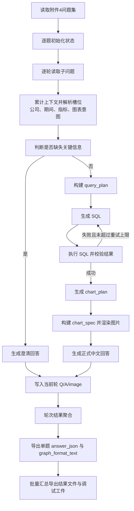
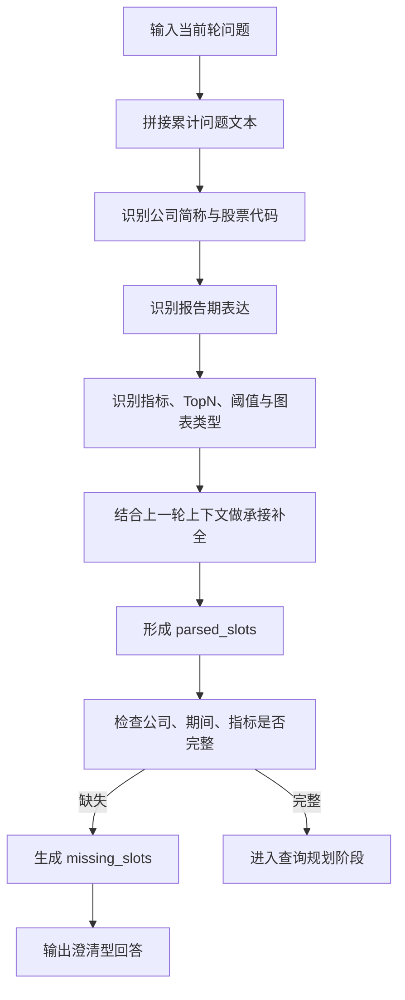
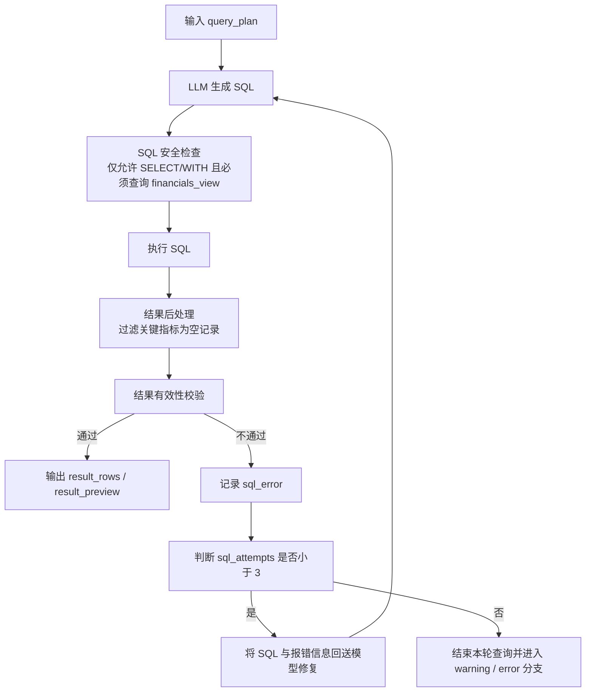
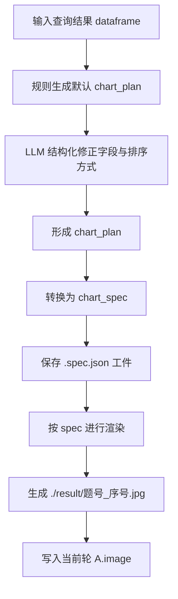
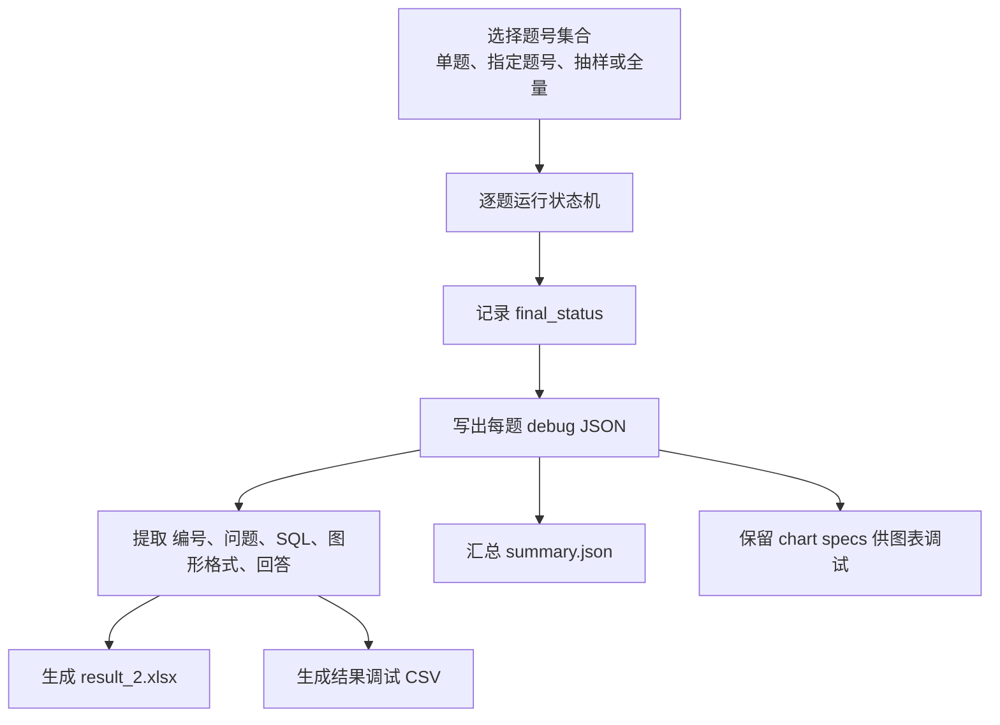

# 任务二算法流程图

## 一、算法流程说明

任务二旨在将自然语言问题自动映射为结构化查询、中文回答与图表结果，并进一步导出为符合赛题要求的标准提交文件。由于题目同时包含多轮上下文承接、结构化 SQL 生成、结果质量控制和图表输出等要求，其算法设计不能停留在单步问答层面，而应构建包含解析、判定、修复、渲染和导出的多阶段处理流程。

当前实现以 LangGraph 状态机为主线，将任务二拆分为若干职责明确的节点，并通过共享状态维护当前轮次、槽位解析结果、SQL 历史、查询结果与图表路径等中间信息，从而使整个求解过程具备可追踪、可修复和可复现的特征。

## 二、总体算法流程

图 1 展示了任务二从问题输入到结果导出的总体算法流程。

图 1 任务二总体算法流程

## 三、问题解析与澄清流程

任务二中的多轮问题具有明显的上下文承接特征，因此问题解析过程需要同时考虑当前轮文本与历史轮次信息。图 2 展示了该部分算法流程。

图 2 任务二问题解析与澄清流程

## 四、查询生成与自动修复流程

自然语言问题即使已经完成槽位解析，也不一定能够一次生成正确 SQL。为此，系统采用“生成 - 执行 - 反馈 - 修复”的闭环算法。图 3 给出了该流程。

图 3 任务二查询生成与自动修复流程

## 五、图表规划与渲染流程

为提高图表输出的可控性与复现性，系统没有直接让模型输出绘图结果，而是采用“规划 - 规格化 - 渲染”的三层算法。图 4 展示了该部分流程。

图 4 任务二图表规划与渲染流程

## 六、批量运行与结果导出流程

单题执行结束后，系统还需要将全部题目结果汇总为正式提交文件，并同步保留调试信息。图 5 展示了批量导出流程。

图 5 任务二批量运行与导出流程

## 七、算法步骤概括

从实现角度看，任务二算法可概括为以下步骤：

1. 读取问题汇总、公司信息和任务一数据库，并构建统一查询视图 `financials_view`。
2. 对每道题逐轮初始化状态，并拼接累计问题文本。
3. 解析公司、报告期、指标、图表类型、TopN 和阈值等槽位信息。
4. 结合上一轮上下文判断信息是否完整，并在必要时生成澄清回答。
5. 对信息充分的问题构建结构化 `query_plan` 并生成 SQL。
6. 对 SQL 执行结果进行安全校验、有效性判定和自动修复重试。
7. 对有效结果生成正式回答，并在需要时采用结构化枚举兜底。
8. 对需要绘图的问题生成 `chart_plan`、`chart_spec` 并输出图片文件。
9. 将每轮 `Q/A/image` 写入会话结构，形成最终 `answer_json`。
10. 汇总全部题目结果，导出提交主表、调试文件和中间工件。

## 八、算法流程的意义

该算法流程的核心价值在于将任务二从一次性生成答案的黑箱过程，转化为可拆解、可回放、可调优的显式求解链路。与单步自然语言转 SQL 的方法相比，本文算法在多轮承接、错误修复和图表规范输出方面具有更高的稳定性，也更符合数学建模竞赛中“结果可解释、过程可复核”的要求。
