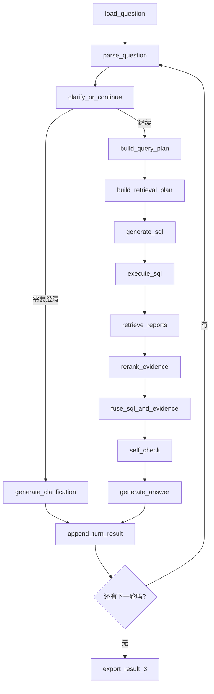

# 任务三完成流程与技术方案

## 1. 当前建议

当前更推荐的推进顺序是：

1. 先把任务一继续提质，尽量降低数据库缺失、异常值和错位值。
2. 再把任务二的 LangGraph 框架收口到稳定可用。
3. 最后正式推进任务三。

原因是：

- 任务三会直接复用任务一数据库。
- 任务三的主框架会高度复用任务二已经搭好的 `LangGraph + LLM + chart_spec` 结构。
- 如果任务一数据质量和任务二工作流还不稳定，任务三的检索、融合和分析会被连带污染。

因此，任务三当前更适合作为“框架先设计、后落地实现”的阶段性工作。

---

## 2. 任务三目标

任务三的目标不是单纯做数据库问数，而是在任务二基础上加入研报知识增强，形成：

- 财务数据库查询
- 研报知识检索
- 证据融合分析
- 多意图拆解
- 归因分析
- 自检与引用输出

整体形态应为：

`SQL + RAG + LangGraph`

---

## 3. 最终版推荐技术栈

### 3.1 基础框架

- Python
- LangGraph
- LangChain
- pandas
- SQLAlchemy
- openpyxl

### 3.2 数据库

- SQLite / MySQL
- 继续复用任务一数据库
- 运行时构建统一宽表视图

### 3.3 PDF 与文本处理

- PyMuPDF
- pdfplumber

### 3.4 检索与向量化

- 嵌入模型：硅基流动平台上的 `bge-m3`
- 向量库：FAISS
- 第一版可先不接复杂 reranker
- 后续若效果不足，再考虑：
  - `Qwen Embedding`
  - reranker

### 3.5 大模型

- 继续使用 OpenAI 兼容接口
- 当前推荐沿用硅基流动平台

### 3.6 图表

- 继续复用任务二的：
  - `chart_plan -> chart_spec -> renderer`

---

## 4. 任务三完整完成流程

### 4.1 数据准备层

输入两类数据：

1. 任务一数据库
   - 四张财务表
   - 或统一宽表 `financials_view`

2. 附件 5 研报数据
   - 个股研报 PDF
   - 行业研报 PDF
   - 个股/行业研报信息表

这一层要做：

- 文件清单整理
- 元数据标准化
- PDF 文本抽取
- 文本切片
- 向量索引构建

### 4.2 问题理解层

对附件 6 问题进行解析，识别：

- 是否需要数据库查询
- 是否需要研报检索
- 是否需要两者同时参与
- 是否需要澄清
- 是否属于归因分析
- 是否属于开放性问题

建议将问题路由为：

- `sql_only`
- `rag_only`
- `hybrid_sql_rag`
- `clarification`
- `open_analysis`

### 4.3 SQL 查询层

复用任务二能力：

- 抽取公司 / 报告期 / 指标
- 生成 SQL
- 查询数据库
- 做结果校验
- 返回结构化数值结果

### 4.4 RAG 检索层

建议流程：

1. 研报 PDF 抽文本
2. 按标题 / 段落 / 页码切片
3. 用 `bge-m3` 生成 embedding
4. 建 FAISS 索引
5. 根据问题检索 top-k 证据
6. 做元数据过滤和简单 rerank
7. 输出最终证据片段

建议区分两类检索源：

- 个股研报
- 行业研报

并根据问题自动收缩检索范围：

- 问公司驱动因素：优先个股研报
- 问行业趋势：优先行业研报
- 问“公司与行业关系”：同时检索两类

### 4.5 融合推理层

不是简单把 SQL 结果和研报原文拼接，而是做：

- 财务结论提炼
- 研报证据提炼
- 归因分析
- 一致性检查
- 最终回答生成

最终回答建议至少包含：

1. 直接结论
2. 财务数据支撑
3. 研报证据支撑
4. 综合归因判断

### 4.6 自检层

至少检查：

- 回答中的财务数字是否与 SQL 一致
- 回答中的研报观点是否真实来自检索证据
- 是否遗漏题目要求的子问题
- 是否把观点说成事实
- 是否出现证据与结论冲突

### 4.7 导出层

最终导出：

- `result_3.xlsx`
- 检索与回答 debug 文件
- 证据明细
- 中间状态日志

---

## 5. 任务三推荐 LangGraph 工作流

建议主节点如下：

1. `parse_question`
2. `clarify_or_continue`
3. `build_query_plan`
4. `build_retrieval_plan`
5. `generate_sql`
6. `execute_sql`
7. `retrieve_reports`
8. `rerank_evidence`
9. `fuse_sql_and_evidence`
10. `self_check`
11. `generate_answer`
12. `export_result`

对应流程：



---

## 6. 任务三推荐目录结构

建议直接参考任务二，单独建立：

```text
src/task3_langgraph/
  app/
  config/
  graph/
  nodes/
  prompts/
  schemas/
  services/
  tools/
```

建议新增的重点工具模块：

- `tools/report_parser.py`
- `tools/retrieval.py`
- `tools/vector_store.py`
- `tools/evidence_fusion.py`
- `tools/self_check.py`

---

## 7. 任务三和任务二的关系

任务三不是推翻任务二，而是在任务二现有框架上新增：

- 检索计划
- 研报检索
- 证据重排
- 融合分析
- 自检

也就是说，任务二的这些能力会直接复用：

- 多轮问题解析
- 澄清门控
- SQL 生成
- SQL 校验
- 图表 `chart_spec`
- 正式导出链路

---

## 8. 当前最推荐的推进顺序

### 阶段一：先把任务一、任务二收稳

当前优先做：

1. 任务一：
   - 附件 3 字段来源约束继续落实
   - 提取层继续减少错位和缺失
   - 继续治理异常值

2. 任务二：
   - 全量 70 题回归
   - Prompt 调优
   - 图表策略调优
   - 澄清逻辑收口

### 阶段二：再正式推进任务三

正式推进时建议顺序：

1. 先搭 `task3_langgraph` 目录骨架
2. 先接附件 6 题目读取
3. 先做研报文本抽取与切片
4. 再做 `bge-m3 + FAISS` 检索
5. 再接 LangGraph 节点
6. 最后做融合回答与自检

---

## 9. 最终设计原则

任务三最终版应遵循：

- 数据库给事实
- RAG 给证据
- LangGraph 管流程
- LLM 负责规划、融合和表述

不建议把任务三做成“让模型自由发挥分析”的模式，而应做成：

**结构化数据 + 检索证据 + 可追踪状态流**

这样最稳，也最适合竞赛答辩与论文表达。
