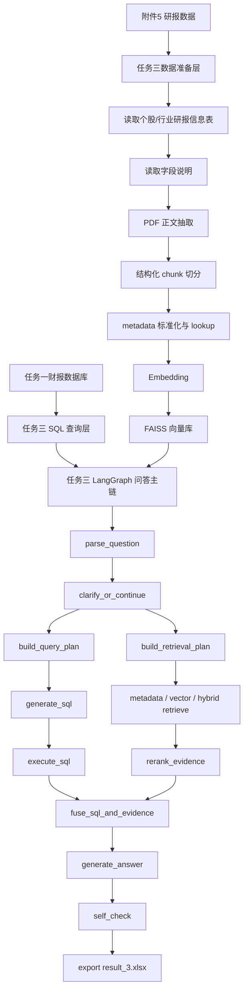

# 任务三架构与 Embedding 方案说明

## 1. 当前结论

任务三当前建议继续按这条主线推进：

- 先把**数据准备层**做扎实
- 再继续扩大小样本的 `SQL + RAG + LangGraph` 回答验证
- 最后再做回答质量、引用格式、图表链等调优

当前数据准备层已经具备：

- 附件 5 三个表接入
- PDF 正文抽取
- 标题/段落优先切 chunk
- `metadata_ref + metadata_lookup`
- `bge-m3` embedding
- `FAISS`
- `metadata / vector / hybrid` 检索底座
- 分批 embedding、暂停、断点续建

这意味着任务三现在已经不是“纯骨架”，而是进入了**可用第一版**。

---

## 2. 任务三分层架构

---

## 3. 每一层现在使用的技术

### 3.1 数据准备层

#### 3.1.1 研报元数据接入

使用文件：

- `正式数据/附件5：研报数据/个股_研报信息.xlsx`
- `正式数据/附件5：研报数据/行业_研报信息.xlsx`
- `正式数据/附件5：研报数据/字段说明.xlsx`

使用技术：

- `pandas`
- 自定义字段语义标准化

作用：

- 给每篇研报建立标准化 metadata
- 区分 `source_type=stock` 和 `source_type=industry`
- 为后续检索、过滤、引用提供基础字段

#### 3.1.2 PDF 正文抽取

使用技术：

- `PyMuPDF`

当前实现不是“先转 markdown 再切块”，而是：

- `PDF -> 纯文本 -> 结构化切分`

原因：

- 中文研报 PDF 转 markdown 不一定稳定
- 当前阶段优先保证抽取和切分的可控性

#### 3.1.3 chunk 切分

当前策略：

- 标题/段落优先
- 图表/表格标题优先
- 超长正文再滑窗切分

当前 chunk 已包含：

- `page_start`
- `page_end`
- `section_title`
- `subsection_title`
- `chunk_type`
- `figure_table_refs`
- `visual_caption`

这一步已经开始为附件 7 的 `references` 做准备。

#### 3.1.4 Embedding

当前采用：

- `BAAI/bge-m3`
- 硅基流动 OpenAI 兼容 embedding API

对应代码：

- `src/task3_langgraph/services/embedding.py`

#### 3.1.5 向量库

当前采用：

- `FAISS IndexFlatIP`

对应代码：

- `src/task3_langgraph/tools/vector_store.py`

支持能力：

- 分批 embedding
- 批次间暂停
- 断点续建
- 本地缓存
- `index.faiss` 持久化

#### 3.1.6 检索模式

当前有三种：

- `metadata`
- `vector`
- `hybrid`

含义：

- `metadata`：主要基于标题、公司、行业、机构、日期等元信息检索
- `vector`：基于 `bge-m3` 向量语义相似度检索
- `hybrid`：两者结合

推荐主模式：

- `hybrid`

---

### 3.2 SQL 查询层

任务三会直接依赖任务一数据库：

- `outputs/task1/task1_financials.db`

使用技术：

- `SQLite`
- `SQLAlchemy`
- `pandas`

作用：

- 给任务三提供结构化财务事实
- 作为 RAG 融合时的“数值证据”

---

### 3.3 LangGraph 回答主链

当前使用：

- `LangGraph`
- `LangChain`
- OpenAI 兼容 LLM 接口

主要节点：

- `parse_question`
- `clarify_or_continue`
- `build_query_plan`
- `build_retrieval_plan`
- `generate_sql`
- `execute_sql`
- `retrieve_reports`
- `rerank_evidence`
- `fuse_sql_and_evidence`
- `generate_answer`
- `self_check`
- `export_result`

当前状态：

- 主链已打通
- 小样本 4 题已跑通
- 还需要继续优化回答质量和引用质量

---

## 4. Embedding 在什么时候发挥作用

Embedding **不是在回答最后一步才发挥作用**，而是在**数据准备层建库**和**检索层召回**两个地方发挥作用。

### 4.1 建库时

流程：

1. 抽出研报正文 chunk
2. 用 embedding 模型把 chunk 转成向量
3. 写入 FAISS 索引

这一步的目标是：

- 让研报正文变成可按“语义相似”检索的知识库

### 4.2 回答时

流程：

1. 把用户问题转成向量
2. 到 FAISS 里找最相关的 chunk
3. 把召回结果和 SQL 结果一起送入融合回答

这一步的目标是：

- 不是靠关键词死匹配
- 而是按“语义接近”找证据

### 4.3 所以 Embedding 的价值是什么

如果只做 metadata 检索，系统更容易找到：

- 标题里直接提到“云南白药”
- 或行业名直接匹配“中药”

但如果用户问：

- “盈利改善的驱动因素是什么”

研报正文里未必会用完全一样的话，而可能写成：

- “毛利率回升主要受产品结构优化及成本控制改善驱动”

这种时候 embedding 才是真正起作用的地方。

---

## 5. `bge-m3` 和 `Qwen3-Embedding` 怎么选

### 5.1 当前选择 `bge-m3` 的理由

当前项目先用 `bge-m3` 是合理的，原因是：

- 中文检索成熟度高
- 研报 RAG 场景比较常用
- 硅基流动上可直接调用
- 免费，适合现在先把全链路跑通

根据硅基流动 embedding 文档：

- `BAAI/bge-m3` 最大输入长度为 `8192 tokens`
- `Qwen/Qwen3-Embedding-*` 最大输入长度为 `32768 tokens`

来源：

- [SiliconFlow 创建嵌入请求](https://docs.siliconflow.cn/cn/api-reference/embeddings/create-embeddings)

### 5.2 Qwen3-Embedding 系列可能更强吗

**有可能更强，尤其是在多语言、长文本、 instruction-aware 检索场景。**

Qwen 官方在 2025 年发布的 Qwen3 Embedding 博客中给出了这些信息：

- `Qwen3-Embedding-0.6B`：`1024` 维
- `Qwen3-Embedding-4B`：`2560` 维
- `Qwen3-Embedding-8B`：`4096` 维
- 三个模型都支持：
  - `32K` 上下文
  - 自定义维度
  - instruction-aware

来源：

- [Qwen3 Embedding 官方博客](https://qwenlm.github.io/blog/qwen3-embedding/)

### 5.3 它们会不会比免费的 `bge-m3` 更好

我的判断是：

- **大概率会更强或至少不弱**
- 尤其在以下场景里更可能有提升：
  - 长文档检索
  - 跨段落语义匹配
  - 复杂开放式问题
  - 多轮问题与 retrieval plan 配合

但这不是“必然立刻显著更好”，因为任务三最终效果不只取决于 embedding，还取决于：

- chunk 切分质量
- metadata 标准化质量
- retrieval plan
- rerank
- answer prompt
- 任务一数据库质量

所以建议顺序仍然是：

1. 先用 `bge-m3` 把整条链路做稳
2. 后面如果检索效果不够，再对比：
   - `bge-m3`
   - `Qwen3-Embedding-0.6B`
   - `Qwen3-Embedding-4B`

### 5.4 选型建议

当前阶段建议：

- 第一版：`BAAI/bge-m3`
- 第二版效果对比：`Qwen/Qwen3-Embedding-0.6B`
- 如果后续追求更高效果，再看：
  - `Qwen/Qwen3-Embedding-4B`

不建议当前阶段直接上 `8B`，因为：

- 成本更高
- 构建全量知识库更慢
- 还不确定当前瓶颈是不是 embedding 本身

---

## 6. 当前全量知识库建一次大概要多少钱

### 6.1 先看当前知识库规模

根据当前本地 `report_chunks.json` 统计：

- `chunk_count = 60711`
- `chars = 6968285`
- `nonspace_chars = 6712247`
- 平均每个 chunk 约 `114.78` 字符

也就是说，当前全量知识库正文总量大约是：

- **670 万到 700 万个有效字符**

### 6.2 token 怎么估

对中文文本，粗略估计可以用：

- `1 个汉字 ≈ 1 token` 左右

所以当前全量知识库 embedding token 量可以先粗估为：

- **约 670 万到 700 万 tokens**

为了保守一点，可以按：

- `6.7M ~ 8.0M tokens`

这个区间估算。

### 6.3 按你给的硅基流动报价估算

你给出的价格是：

- `Qwen3-Embedding-0.6B`：`0.00007 / K Tokens`
- `Qwen3-Embedding-4B`：`0.00014 / K Tokens`
- `Qwen3-Embedding-8B`：`0.00028 / K Tokens`

> 注：这里按你当前提供的硅基流动报价估算，实际以平台实时价格页为准。

#### 按 `6.7M tokens` 估算

- `0.6B`：
  - `6700 * 0.00007 ≈ 0.469`
- `4B`：
  - `6700 * 0.00014 ≈ 0.938`
- `8B`：
  - `6700 * 0.00028 ≈ 1.876`

#### 按 `8.0M tokens` 估算

- `0.6B`：
  - `8000 * 0.00007 ≈ 0.56`
- `4B`：
  - `8000 * 0.00014 ≈ 1.12`
- `8B`：
  - `8000 * 0.00028 ≈ 2.24`

### 6.4 结论

如果你现在这个全量知识库完整跑一遍 embedding：

- `Qwen3-Embedding-0.6B` 大约是 **0.47 ~ 0.56**
- `Qwen3-Embedding-4B` 大约是 **0.94 ~ 1.12**
- `Qwen3-Embedding-8B` 大约是 **1.88 ~ 2.24**

如果平台计费单位是人民币，那么这就是**一次全量建库的大致人民币成本**；如果平台页面单位另有说明，则按实际平台说明为准。

### 6.5 为什么成本并不高

因为 embedding 建库通常是：

- **一次性重活**
- 后续主要做增量更新

只要你：

- 不反复清空重建
- 做断点续建
- 做缓存复用

那 embedding 成本通常是可控的。

---

## 7. 当前状态总结

### 已完成

- 附件 5 metadata 接入
- 字段说明接入
- PDF 正文抽取
- 标题/段落优先 chunk
- 引用基础字段准备
- `bge-m3`
- `FAISS`
- 分批 embedding
- 断点续建
- 小样本回答链跑通

### 已搭好框架但未优化

- retrieval plan
- rerank
- references 质量
- answer quality
- chunk 结构质量

### 还没正式做实

- 任务三图表链
- 更强 reranker
- 更精细的图表/表格引用定位
- 附件 7 最终提交级别的 `references` 格式完全对齐

---

## 8. 建议的下一步

建议按这个顺序推进：

1. 先把全量向量索引建好
2. 再做小样本 retrieval 验证
3. 再扩大小样本回答验证
4. 最后再做 `references` 和回答质量优化

当前不建议立刻切到 `Qwen3-Embedding-4B/8B`，因为：

- 现在任务三的主要瓶颈还不一定是 embedding
- 更可能还在：
  - chunk 质量
  - retrieval plan
  - rerank
  - answer prompt

更稳的路线是：

- 先用免费 `bge-m3` 把链路跑稳
- 再做 embedding 模型 A/B 测试

