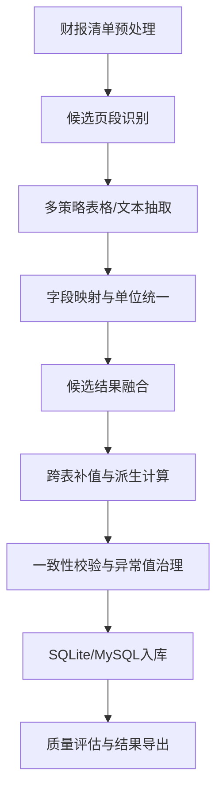

# 4 任务一：结构化财报数据库的建模与求解

## 4.1 财报信息抽取问题的学术背景

任务一要求从上市公司财务报告 PDF 中提取四张核心财务报表，并按统一字段结构完成标准化转换、质量校验与数据库入库。该问题本质上属于复杂半结构化文档的结构化信息抽取问题，同时具有明显的金融领域约束。

从现有研究看，PDF 表格抽取方法大致可以分为两类。第一类是规则与表格解析主导的方法，依赖页面文本块、表格边线、关键词和版面启发式规则完成表格定位与字段提取，这类方法在版式较稳定场景下具有较高精度与较低部署成本。第二类是基于版面理解的深度学习方法，如 LayoutLM、StructuralLM、DocFormer 等，通过联合编码文本与版面位置关系直接输出结构化结果，在通用文档理解任务中表现较好，但通常需要较高的标注成本和较强的算力支撑。

对于本赛题而言，财报数据具有以下特点：

1. 报告数量大，需对上千份 PDF 进行批量处理；
2. 不同交易所、不同公司、不同年份报告版式差异显著；
3. 报表项目具备稳定的财务语义和明确的勾稽关系；
4. 缺乏可用于深度模型微调的大规模标注样本；
5. 最终结果不仅要“抽出来”，还必须“可入库、可校验、可支撑后续问数任务”。

因此，本文采用“规则主导、多策略抽取、表间协同修正、质量复核闭环”的工程建模路线。该路线充分利用财务披露中的专业术语、报表结构与会计勾稽关系，将任务一建模为“候选页段识别—多源抽取—标准化映射—表间约束补值—一致性校验”的分阶段优化问题。

## 4.2 问题定义与建模目标

设财报 PDF 集合为

$$
P=\{p_1,p_2,\dots,p_n\},
$$

其中每份财报 $p_i$ 包含若干页面。目标输出表集合记为

$$
T=\{T_{bal},T_{cf},T_{core},T_{inc}\},
$$

分别对应资产负债表、现金流量表、核心业绩指标表和利润表。

对任一财报 $p_i$，任务一需要完成如下映射：

$$
f:p_i \rightarrow \{r_{bal},r_{cf},r_{core},r_{inc}\},
$$

其中 $r_*$ 为带有统一业务键

$$
(\text{stock\_code},\text{report\_period},\text{report\_year})
$$

的结构化记录。

任务一的建模目标可以概括为：

1. **准确定位目标报表页段**：在非固定页码、跨页续表和噪声页面混杂条件下，稳定识别目标表位置；
2. **完成字段级结构化抽取**：将自然语言表头统一映射到附件 3 的目标字段；
3. **保证单位与口径一致**：统一金额单位、比例单位和每股指标口径；
4. **利用表间关系补齐缺失并修正异常**：通过跨表一致性提升覆盖率与稳定性；
5. **形成可复核的数据底座**：支持数据库入库、质量评估与后续任务复用。

为此，本文将任务一进一步分解为以下五个子模型：

1. 候选页段评分模型；
2. 多策略抽取模型；
3. 字段映射与单位标准化模型；
4. 跨表补值与一致性修正模型；
5. 数据校验与质量评估模型。

进一步地，若以四张表的平均字段覆盖率记为

$$
Cov=\frac{1}{|T|}\sum_{T_j\in T}Cov(T_j),
$$

以校验失败率记为

$$
Err=\frac{N_{warn}+N_{fail}}{N_{all}},
$$

以高缺失字段数记为 $Miss_{high}$，则任务一的整体优化目标可以写为

$$
\max J=\alpha Cov-\beta Err-\gamma Miss_{high},
$$

其中 $\alpha,\beta,\gamma>0$ 为权重系数。该目标函数并不用于梯度求解，而是作为整条工程优化链路的评价准则：既追求覆盖率提升，也约束异常值、warning 和长尾缺失的增加。

## 4.3 总体处理框架

任务一整体流程如图所示，可概括为“预处理—定位—抽取—转换—融合—校验—入库—评估”八个步骤：

与初始版本相比，当前任务一主线优化版本的关键改进不在于单点修补，而在于形成了以下统一思想：

- 从“命中即用”转向“候选评分择优”；
- 从“单表孤立抽取”转向“多表协同纠错”；
- 从“统一后处理”转向“按抽取来源分类处理”；
- 从“派生覆盖直读”转向“直读优先、异常才回填”；
- 从“缺失即抽取失败”转向“区分未披露、不可计算、真缺失”三类原因。

此外，当前求解框架并非只由本轮调试构成，而是在原始流水线基础上持续叠加了若干底层优化，包括：

1. 对股票代码、公司简称、报告年份和报告期进行统一标准化，保证不同来源文件能够映射到同一业务键；
2. 对同一财报的多源候选结果按完整度、来源稳定性与 warning 数量进行排序融合，而非简单保留单次抽取结果；
3. 在字段级别引入候选打分、噪声标签过滤与附注编号规避机制，减少“错映射比缺失更糟糕”的问题；
4. 在评估层输出字段覆盖率、缺失原因、人工抽检模板与 validation log，形成“抽取—复核—再优化”的闭环。

从程序实现角度看，当前优化后的任务一并不是单个抽取器，而是由若干功能模块协同构成：

1. `metadata.py` 负责股票代码、报告期和公司简称标准化；
2. `extractor.py` 负责候选页段识别、多策略抽取与候选表筛选；
3. `normalizers.py` 负责单位识别、数值解析和字段级换算；
4. `transform.py` 负责字段映射、候选融合、规则回填与跨表派生；
5. `validator.py` 负责入库前一致性校验；
6. `evaluate.py` 与 `quality_review.py` 负责覆盖率、缺失原因和异常值复核；
7. `db.py` 与 `pipeline.py` 负责结构化存储、工件导出与运行闭环。

因此，本文的“建模与求解”并不是单个数学模型，而是一套由元数据预处理、候选排序、规则映射、跨表约束和质量复核共同构成的复合求解系统。

## 4.4 候选页段评分模型

### 4.4.1 设计思路

初始版本采用“找到第一个命中关键词页面即作为目标页”的策略，容易出现以下问题：

- 命中目录页或会计政策说明页等噪声页；
- 只抓到报表第一页，遗漏跨页续表；
- 命中错误口径字段，如将“归属于母公司权益”误当作“所有者权益合计”。

因此，本文将页段识别问题建模为候选排序问题。对每一张报表，先生成多个候选页段，再对候选页段进行综合评分，选择得分最高者进入抽取阶段。

### 4.4.2 评分函数

设某一候选页段为 $c$，其评分函数定义为

$$
Score(c)=w_1A(c)+w_2D(c)+w_3U(c)+w_4K(c)-w_5N(c),
$$

其中：

- $A(c)$：字段别名命中强度；
- $D(c)$：数字密度；
- $U(c)$：单位信号强度；
- $K(c)$：关键财务字段命中强度；
- $N(c)$：噪声页惩罚项。

其中，候选集合本身可记为

$$
\mathcal{C}_t(p_i)=\{c_1,c_2,\dots,c_m\},
$$

表示财报 $p_i$ 中针对目标表 $t$ 构造出的所有候选页段。最终被选中的页段为

$$
c_t^*=\arg\max_{c\in \mathcal{C}_t(p_i)} Score(c).
$$

在实现上，上式中的各部分分别对应如下可计算信号：

$$
A(c)=\sum_{a\in \mathcal{A}_t}\mathbf{1}(a\subset c),
$$

其中 $\mathcal{A}_t$ 为目标表的别名集合；

$$
D(c)=\min\left(\frac{\#digits(c)}{80},10\right),
$$

用于刻画页段中的数值密度；

$$
U(c)=\mathbf{1}(\text{单位信号存在})\cdot 8+\mathbf{1}(\text{项目列信号存在})\cdot 4;
$$

$$
K(c)=12\sum_{k\in \mathcal{K}_t}\mathbf{1}(k\subset c),
$$

其中 $\mathcal{K}_t$ 为该表的关键字段集合；

$$
N(c)=25\cdot \mathbf{1}(\text{命中审计报告/会计政策变更/关联交易等噪声页}).
$$

其中噪声页惩罚主要针对：

- 审计报告；
- 会计政策变更；
- 关联交易说明；
- 附注与正文叙述段落。

这使得页段定位从简单关键词匹配升级为“语义信号 + 数值信号 + 版式信号”的综合判别过程。

### 4.4.3 跨页识别

针对财报中常见的跨页续表问题，本文对现金流量表、利润表等目标表增加了起始页与终止页联合识别策略。例如：

- `合并年初到报告期末现金流量表`
- `年初到报告期末现金流量表`
- `所有者权益变动表`
- `审计报告`

等关键词共同决定页段边界。该策略显著改善了深交所三季报中现金流量表只抽到半页的问题。

## 4.5 多策略抽取模型

### 4.5.1 抽取来源设计

考虑到不同财报页面的结构差异，本文没有依赖单一提取器，而是构建了多策略抽取链路：

1. `PyMuPDF` 页面与表格定位；
2. `pdfplumber` 表格抽取；
3. `camelot` 作为补充结构化表格抽取器；
4. 文本兜底与续表重建。

其中，结构化表格来源更适合处理：

- 网格清晰的标准报表；
- 多列表头页面；
- 典型财务表版式。

文本兜底更适合处理：

- 拆行标签；
- 续表换页；
- 某些提取器无法还原的文本型表格页面。

这种“结构化抽取 + 文本兜底”的融合模式提高了长尾版式下的鲁棒性。

从形式化角度看，设第 $k$ 个抽取器为 $E_k$，则对目标表 $t$ 的候选抽取结果集合可写为

$$
\mathcal{R}_t=\bigcup_{k=1}^{K}E_k(c_t^*).
$$

为避免低质量候选直接进入后续映射阶段，系统进一步对候选表计算质量得分：

$$
Q(r)=\lambda_1 H(r)+\lambda_2 M(r)+\lambda_3 R(r),
$$

其中：

- $H(r)$ 表示字段别名命中数；
- $M(r)$ 表示数值单元格密度；
- $R(r)$ 表示有效行数信号。

只有当 $Q(r)$ 高于表级阈值时，候选表才会被保留。这一设计对应代码中的 `_table_quality_score` 与 `_quality_threshold`，其作用是减少由碎片文本、误识别表格和正文噪声带来的伪候选。

### 4.5.2 按来源分类处理

当前版本中的一个重要优化思想是：后处理不能对所有抽取来源一刀切。

例如，对于结构化表格来源，若某些字段标签明确存在而金额为空，则更可能表示真实的 `0`；而对于文本拼接来源，金额可能出现在下一行，若直接将空白解释为 `0`，反而会吞掉真实值。

因此，本文对不同来源采取不同策略：

- 对 `pdfplumber / camelot / find_tables` 等结构化来源，允许对部分字段启用“空白按 0 处理”；
- 对 `fitz.combined_text / text_fallback` 等文本来源，不启用该策略。

这一处理显著改善了：

- 短期借款；
- 取得借款收到的现金；
- 偿还债务支付的现金；

等字段在结构化表格中的缺失问题，同时避免了文本模式的错误截断。

需要指出的是，这一策略本身带有明确的建模假设：若结构化表格中某个目标字段标签稳定出现、金额单元格为空且同页表格结构完整，则将该空白解释为 `0` 往往比解释为“抽取失败”更合理。当前版本中，该策略主要用于：

- `asset_trading_financial_assets`
- `liability_advance_from_customers`
- `liability_short_term_loans`
- 若干融资和投资现金流字段

因此，最终数据库中这类字段出现较多 `0`，并不必然表示程序错误，而更多反映了“报表保留字段行名但金额栏空白”的披露方式。尤其是 `预收款项` 字段，在大量公司已转向 `合同负债` 口径后，旧字段行仍常被保留但数值为空。

## 4.6 字段映射与单位标准化模型

### 4.6.1 字段映射

财报中同一指标往往存在多种表达方式，因此需将自然语言表头统一映射到目标字段集合。本文构建了字段别名词典，将原始标签映射到统一 schema，并结合公司样本和历史报告补充同义表达。

若记原始标签空间为 $\mathcal{L}$，目标字段集合为 $\mathcal{S}$，则字段映射问题可表示为

$$
g:\mathcal{L}\rightarrow \mathcal{S}.
$$

但在实际场景中，同一标签可能对应多个候选字段，因此本文并未采用简单的一次性硬映射，而是定义字段候选得分

$$
Score_f(l,s)=\eta_1 Match(l,s)+\eta_2 Num(l)+\eta_3 Sem(l,s)-\eta_4 Penalty(l,s),
$$

其中：

- $Match(l,s)$ 衡量别名匹配强度；
- $Num(l)$ 衡量该行数值形态是否像财务字段；
- $Sem(l,s)$ 衡量标签与字段在财务语义上的一致性；
- $Penalty(l,s)$ 则用于惩罚附注编号、章节噪声和易混标签。

例如，在 `equity_total_equity` 映射中，若标签包含“归属于母公司”或“少数股东权益”，则会显式降权；若标签包含“所有者权益合计”“股东权益合计”，则会显式加权。这使字段映射不再是“字面相似度最大”问题，而是“字面、数字与财务语义联合判别”问题。

与单纯扩展映射词典不同，本文还主动清理了危险别名，例如带章节编号或正文描述性质的标签，以避免将叙述文本误映射为金额字段。

进一步地，最新优化将“行级映射”从“命中首个别名即停止”改为“对同一行命中的全部别名进行评分，再选择得分最高者”。若某一行标签为 $l$，命中别名集合为 $\mathcal{A}(l)$，则最终映射字段写为

$$
s^*(l)=\arg\max_{a\in \mathcal{A}(l)} Score_f(l, g(a)),
$$

其中 $g(a)$ 表示别名 $a$ 对应的目标字段。该修补专门解决了类似“`每股收益` 这一短别名先于 `基本每股收益（元/股）` 命中，从而让解释性文本行抢占正式指标行”的问题。

### 4.6.2 单位标准化

对金额类字段，统一将 `元`、`万元`、`亿元` 换算到同一尺度；对比例类字段，统一处理百分号、百分点和括号负号。

同时，针对 PDF 文本抽取中常见的数值噪声，本文还进行了以下底层清洗：

- 合并被拆开的负号与数字；
- 去除千分位分隔符、脚注编号与无意义标点；
- 识别“标签换行、数值续行”的行级碎片，并在映射前完成重组。

特别地，对于每股类字段：

- `eps`
- `net_asset_per_share`
- `operating_cf_per_share`

本文不再继承页面级金额单位，而是保持“元/股”本身的原始尺度。这一修正解决了早期版本中 `EPS` 被错误放大到上万级的问题。

## 4.7 候选结果融合与直读优先策略

同一份报告可能从多个来源得到多条候选记录。本文按

$$
(\text{stock\_code},\text{report\_period},\text{report\_year},\text{table\_name})
$$

对候选记录分组，并优先保留字段更完整、来源更稳定、warning 更少的候选。

在字段级融合上，本文明确采用“直读优先、异常再回填”的策略：

- 若字段已从 PDF 表格中直接抽出，则默认保留；
- 仅当字段缺失或明显异常时，才允许复用值或派生值覆盖。

这对应于规则模式从：

- `prefer_derive`
- `prefer_reuse`

转向：

- `direct_or_derive`
- `direct_or_reuse`

这种设计避免了派生值无条件覆盖真实披露值，尤其适用于财务指标中披露口径不完全等于简单公式推导值的情况。

从排序角度看，对同一业务键下的候选记录 $r$，本文定义综合排序优先级

$$
Rank(r)=\mu_1 P_{method}(r)+\mu_2 C_{field}(r)+\mu_3 I_{full}(r)-\mu_4 W(r),
$$

其中：

- $P_{method}(r)$ 为抽取来源优先级；
- $C_{field}(r)$ 为非空字段数；
- $I_{full}(r)$ 表示是否来自全文报告；
- $W(r)$ 表示 warning 数量。

最终保留

$$
r^*=\arg\max_{r\in\mathcal{R}_t}Rank(r),
$$

再对其余候选进行缺失字段补并。这样既保留了高质量直读结果，又能利用其他来源补足长尾字段。

## 4.8 跨表补值与一致性修正模型

### 4.8.1 资产负债表尾部修正

资产负债表尾部最关键的问题是 `equity_total_equity` 的口径识别。初始版本中，该字段有时会误取“归属于母公司所有者权益”，而不是“所有者权益合计”，导致表内勾稽失败。

为此，本文在候选评分中加入了财务语义约束：

- 对“所有者权益合计”“股东权益合计”等标签加权；
- 对“归属于母公司”“归属于上市公司”“少数股东权益”等标签降权；
- 若

$$
\text{asset\_total\_assets} - \text{liability\_total\_liabilities}
$$

与当前权益值显著不一致，则以差值修正权益合计。

该修正使资产负债表 warning 从早期的大量存在下降到 `0`。

### 4.8.2 比率与每股指标派生

利用报表间关系，可推导以下关键指标：

1. 毛利率

$$
GrossMargin=\frac{Revenue-Cost}{Revenue}\times 100\%
$$

2. 净利率

$$
NetProfitMargin=\frac{NetProfit}{Revenue}\times 100\%
$$

3. 净资产收益率

$$
ROE=\frac{NetProfit}{Equity}\times 100\%
$$

4. 每股净资产

先由净利润与 EPS 反推股本：

$$
Shares=\frac{NetProfit\times 10000}{EPS}
$$

再计算：

$$
NAVPS=\frac{Equity\times 10000}{Shares}
$$

5. 每股经营现金流

$$
OCFPS=\frac{OperatingCF\times 10000}{Shares}
$$

在当前主线版本中，这些派生值不再只是“补空”，而是在现有值明显失真时承担纠偏作用。例如，个别每股净资产字段若与权益和 EPS 反推结果明显矛盾，则以派生值覆盖坏直读值。

同时，为控制派生值的误用，系统只在满足“缺失、异常或明显失真”条件时才启用覆盖。若记原值为 $x$、派生值为 $\hat{x}$，则覆盖条件可简化表示为

$$
\mathbf{1}_{override}=
\mathbf{1}(x=\varnothing)
\lor \mathbf{1}(|x|>\tau_p)
\lor \mathbf{1}(\operatorname{sign}(x)\neq \operatorname{sign}(\hat{x}))
\lor \mathbf{1}(|x-\hat{x}|>\tau_d),
$$

其中 $\tau_p$ 为比例型异常阈值，$\tau_d$ 为差异容忍阈值。该机制对应程序中的 `_should_fill_derived_or_reused_value`、`_should_override_percentage_with_derived` 与 `_should_override_per_share_with_derived`。

### 4.8.3 季度环比补算

核心指标表中大量缺失集中在季度环比字段。针对这一问题，本文将季度环比建模为“累计值还原单季度值”的推导问题。

对于同一年内的累计值：

- `Q1` 直接视为第一季度值；
- `H1-Q1` 得到第二季度值；
- `Q3-H1` 得到第三季度值；
- `FY-Q3` 得到第四季度值。

据此可计算环比增长率：

$$
QoQ=\frac{x_t-x_{t-1}}{|x_{t-1}|}\times 100\%
$$

对于 `Q1` 环比，若同年内无法直接获得上一季度值，则进一步利用：

$$
Q4_{y-1}=FY_{y-1}-Q3_{y-1}
$$

并计算：

$$
QoQ_{Q1,y}=\frac{Q1_y-Q4_{y-1}}{|Q4_{y-1}|}\times 100\%
$$

该改进显著降低了：

- `operating_revenue_qoq_growth`
- `net_profit_qoq_growth`

的缺失数量。

进一步排查发现，季度环比字段之所以在部分样本中仍与程序推导差异很大，并不总是因为公式错误，而往往源于核心指标表在季度报告中的列口径选择问题。许多深交所季度报告在“主要会计数据和财务指标”中同时给出：

1. 本报告期金额；
2. 年初至报告期末金额；
3. 对应同比变动率。

若程序误把第一列“本报告期”金额当作累计值写入 `total_operating_revenue` 或 `net_profit_10k_yuan`，则后续再基于累计值进行单季度还原时，会在逻辑上形成“用单季度值去反推单季度值”的错位，进而使 `QoQ` 偏差被成倍放大。

因此，在最新版本中，本文进一步将 `Q3` 核心指标表抽取建模为“列口径识别”问题：当一行同时出现两组金额和两组同比时，系统优先将第二个金额候选视为“年初至报告期末”口径，再与利润表累计值进行交叉校正。这一修补对：

- `营业收入`
- `归属于上市公司股东的净利润`
- `扣除非经常性损益后的净利润`
- `EPS`

等字段的上游口径稳定性具有决定性作用。

在进一步优化后，本文又将该规则形式化为“对偶数长度数字序列取中位分界点”的列识别策略。设 `Q3` 核心指标表某一行按出现顺序抽取得到数字序列

$$
Z=(z_1,z_2,\dots,z_{2m}),
$$

其中前半部分对应“本报告期”口径，后半部分对应“年初至报告期末”口径，则报告期累计金额取为

$$
x^{Q3}_{cum}=z_{m+1},
$$

而报告期累计同比优先取为

$$
y^{Q3}_{cum}=z_{2m}.
$$

该规则对以下两类场景尤其有效：

1. 标准四列结构：`本报告期金额 / 本报告期同比 / 年初至报告期末金额 / 年初至报告期末同比`；
2. 含追溯调整的八列结构：在“调整前/调整后”并存时，累计口径仍位于序列后半部分起点附近。

这使得 `Q3` 季报中的：

- `营业收入`
- `归母净利润`
- `扣非净利润`
- `EPS`

不再被简单误取为“本报告期”或“本报告期同比”。

除了列口径识别之外，最新版本还增加了“混合标签降噪”机制。若某一行标签同时出现两类及以上核心指标关键词，例如“扣除非经常性损益”与“经营活动”被错误拼接到同一行，则将该行视为噪声候选并从映射与显式同比回填中剔除。设指标关键词集合为 $\mathcal{M}$，则当

$$
\sum_{m\in \mathcal{M}} \mathbf{1}(m\subset l)\ge 2
$$

时，记该行为高风险拼接噪声行，不参与指标映射。该机制在 `特一药业 2024Q3` 这类“扣非净利润行与经营现金流行串接”的样本上具有明显修复作用。

### 4.8.4 利润率口径择优

在后期优化中，本文进一步发现少量核心表毛利率存在明显错误，根源不在计算公式，而在于收入口径选错。为此，将毛利率和净利率的计算建立在“择优收入来源”之上，即优先选择能够与成本、净利润形成合理利润率组合的收入口径。

若收入候选集合为

$$
\mathcal{R}=\{R_{income},R_{kpi}\},
$$

则最终采用的收入口径为

$$
R^*=\arg\min_{R\in \mathcal{R}} \Phi(R),
$$

其中 $\Phi(R)$ 为异常惩罚函数。当前实现中，若基于某一收入计算得到的毛利率或净利率超过合理范围，或出现“净利率显著高于毛利率”的反常关系，则该收入会被赋予更高惩罚值，从而在择优时被淘汰。

例如，可将惩罚函数写为

$$
\Phi(R)=\omega_1\mathbf{1}(|GPM(R)|>100)\cdot |GPM(R)|
+\omega_2\mathbf{1}(|NPM(R)|>100)\cdot |NPM(R)|
+\omega_3\max(0,NPM(R)-GPM(R)-20).
$$

这一改进有效修复了香雪制药、昆药集团、特一药业等样本中的假极端毛利率问题。

### 4.8.5 字段规则约束与收口限制

除了显式公式派生外，本文还在 `field_rules.py` 中对关键字段引入了规则约束，用于控制“直读、复用、派生”三者之间的优先关系。其本质可看作一种字段级约束系统：

$$
x_f=
\begin{cases}
x_f^{direct}, & \text{若直读值存在且未被判定为异常}\\
x_f^{reuse}, & \text{若允许跨表复用且直读缺失}\\
x_f^{derive}, & \text{若允许派生且输入完备}\\
\varnothing, & \text{否则}
\end{cases}
$$

其中：

- `direct_or_reuse` 用于诸如营业收入、净利润等可安全跨表复用的字段；
- `direct_or_derive` 用于资产负债率、净现金流、环比增长率等适合公式补全的字段；
- `direct` 用于 `eps`、扣非净利润等必须优先尊重原始披露口径的字段。

同时，为避免异常值进入数据库，系统还引入了收口限制：

1. 对比例类字段，若

$$
|x|>1000,
$$

则视为异常并在清洗阶段置空；

2. 对金额类字段，若

$$
|x|>10^8
$$

（以万元为统一口径）则视为明显离群；

3. 对股本反推结果，若

$$
Shares<10^6 \quad \text{或} \quad Shares>10^{12},
$$

则认为该样本不满足稳定派生条件，不据此回填每股类字段。

此外，对于核心指标表中的金额字段，本文又增加了一条“跨表累计口径回拉”限制。若核心指标表中的：

- `total_operating_revenue`
- `net_profit_10k_yuan`

与利润表中同报告期累计值在符号或量级上发生明显冲突，则优先采用利润表累计口径。形式化地，可记为：

$$
x_{core}\leftarrow x_{income},
\quad \text{if}\quad
\operatorname{sign}(x_{core})\neq \operatorname{sign}(x_{income})
\ \text{or}\ 
|x_{core}-x_{income}|>\tau_{cum}.
$$

这一约束的目的不是简单“利润表覆盖核心表”，而是防止核心指标表误命中“本报告期”列后，把单季度金额错误写成累计金额，从而污染后续所有派生指标。

针对每股类字段，当前版本又进一步加入了“可信度约束”。设 `EPS`、每股净资产、每股经营现金流分别为

$$
EPS,\quad NAVPS,\quad OCFPS,
$$

则在派生或覆盖前，系统先要求其满足基本尺度约束：

$$
|EPS|\le 20,\qquad |NAVPS|\le 200,\qquad |OCFPS|\le 200.
$$

若超出上述范围，则优先视为高风险坏值并置空，再由其他稳定信息决定是否派生补回。该约束能够有效阻断极端坏值通过股本反推链继续污染 `net_asset_per_share` 与 `operating_cf_per_share`。

## 4.9 数据校验与数据库入库

在形成最终结构化记录后，系统执行“入库前校验 + 入库后复核”的双层质量控制。

### 4.9.1 入库前校验

入库前校验由 `validator.py` 完成，主要包括以下四类规则。

1. **完整性约束**

设记录 $r$ 的必填字段集合为 $\mathcal{M}$，则当

$$
\exists m\in \mathcal{M},\ r[m]=\varnothing
$$

时，该记录触发必填项错误。

2. **业务主键唯一性约束**

记业务主键为

$$
k=(stock\_code,report\_period,report\_year),
$$

则同表内应满足

$$
|\{r\mid key(r)=k\}|=1.
$$

3. **数值合理性约束**

对比例类字段执行

$$
|x|\le 1000,
$$

对金额类字段执行上文给出的离群限制。

4. **跨表一致性预检**

主要包括：

- 资产负债勾稽：

$$
|A-(L+E)|\le \max(100,0.02|A|);
$$

- 现金流勾稽：

$$
|NCF-(OCF+ICF+FCF)|\le \max(100,0.05|NCF|);
$$

- 利润率一致性：

$$
|GPM-\frac{R^*-C}{R^*}\times 100\%|\le \epsilon_g;
$$

- 每股类字段一致性：

$$
\left|NAVPS-\frac{E\times 10000}{Shares}\right|\le \epsilon_{ps},
$$

$$
\left|OCFPS-\frac{OCF\times 10000}{Shares}\right|\le \epsilon_{ps}.
$$

### 4.9.2 入库后勾稽脚本与复核规则

在数据库落库完成后，本文又利用 `scripts/check_task1_accounting_consistency.py` 对最终结果执行更细粒度的复核。更新后的脚本共包含 `16` 条规则，主要分为四组：

1. **报表内部恒等式规则**
   - `balance_equation`
   - `asset_liability_ratio_consistency`
   - `cash_flow_equation`
   - 三类现金流占比一致性规则

2. **核心指标跨表公式规则**
   - `gross_profit_margin_consistency`
   - `net_profit_margin_consistency`
   - `roe_consistency`
   - `net_asset_per_share_consistency`
   - `operating_cf_per_share_consistency`
   - `eps_net_profit_sign_consistency`

3. **结构性合理性规则**
   - `margin_order_consistency`

4. **时序派生规则**
   - `operating_revenue_qoq_consistency`
   - `net_profit_qoq_consistency`
   - `net_profit_excl_non_recurring_yoy_consistency`

从方法论上看，这些规则并不是孤立的程序判断，而是将会计恒等式、比率分析、每股指标定义和时序比较逻辑形式化为可执行约束。其核心思想是：若结构化结果在经济意义上成立，则它不仅应当“有值”，还应当在表内、表间与跨期三个层面同时自洽。

#### 1. 报表内部恒等式规则

`balance_equation` 对应资产负债表最基本的会计恒等式：

$$
A=L+E,
$$

其中 $A$ 表示资产总计，$L$ 表示负债合计，$E$ 表示所有者权益合计。该规则的经济含义是：企业全部资产必须由债务资本与权益资本共同支撑，因此若结构化结果中

$$
A-(L+E)\neq 0,
$$

则通常意味着资产负债表尾部字段发生了错列、漏列或口径误识别，例如把“归属于母公司股东权益”误当成“所有者权益合计”。

`asset_liability_ratio_consistency` 则将资产负债率与资产负债表主金额联系起来：

$$
\rho_{AL}=\frac{L}{A}\times 100\%.
$$

该指标的经济含义是企业资产中由负债融资形成的比例。若表中直接披露的资产负债率与主表金额推导值严重不一致，则说明比例字段或金额字段至少有一侧存在问题。

`cash_flow_equation` 对应现金流量表的基本勾稽关系：

$$
NCF=OCF+ICF+FCF,
$$

其中 $NCF$ 为现金及现金等价物净增加额，$OCF$、$ICF$、$FCF$ 分别为经营、投资与筹资活动净现金流。其经济含义是：企业期内现金净变化，最终应由三类活动共同解释。若该等式不成立，常见原因包括表尾“汇率变动对现金及现金等价物的影响”口径差异、期初期末调整项缺失，或净现金流字段抽取偏差。

三类现金流占比一致性规则进一步约束：

$$
Ratio_{op}=\frac{OCF}{NCF}\times 100\%,\qquad
Ratio_{inv}=\frac{ICF}{NCF}\times 100\%,\qquad
Ratio_{fin}=\frac{FCF}{NCF}\times 100\%.
$$

其经济含义是识别净现金流的来源结构，即企业现金净变动主要由经营造血、投资回收还是筹资扩张驱动。相较 `cash_flow_equation`，这三条规则更容易捕捉“占比字段错填”而非主金额错填的问题。

#### 2. 核心指标跨表公式规则

`gross_profit_margin_consistency` 用利润表中的营业收入与营业成本复核核心指标表中的毛利率：

$$
GPM=\frac{R^*-C}{R^*}\times 100\%,
$$

其中 $R^*$ 为择优后的营业收入口径，$C$ 为营业成本。该规则的经济含义是衡量企业主营业务的单位收入毛利空间。若毛利率异常偏高、偏低或与利润表明显冲突，通常意味着收入字段、成本字段或核心指标口径选取存在错配。

`net_profit_margin_consistency` 则利用净利润和营业收入复核净利率：

$$
NPM=\frac{NP}{R^*}\times 100\%,
$$

其中 $NP$ 为净利润。净利率反映企业将收入最终转化为净收益的能力，是衡量盈利质量的核心指标之一。若净利率与主表数据无法对齐，则会直接影响后续问数中关于盈利能力、行业比较和时间趋势的结论。

`roe_consistency` 使用净利润和所有者权益校验净资产收益率：

$$
ROE=\frac{NP}{E}\times 100\%.
$$

从经济意义上看，$ROE$ 衡量股东投入资本的收益水平，是资本使用效率的核心指标。考虑到季报和中报缺乏稳定平均净资产口径，程序仅在年报、正权益且符号一致的条件下保守使用该规则，以避免把真实的极端财务结构误判为程序错误。

`net_asset_per_share_consistency` 通过权益和推断股本复核每股净资产：

$$
Shares=\frac{NP\times 10000}{EPS},
$$

$$
NAVPS=\frac{E\times 10000}{Shares}.
$$

其经济含义是“每一股普通股对应多少净资产”。若该值与权益、净利润和每股收益联立后明显不自洽，通常意味着 `EPS`、股本推断或权益字段至少有一处发生了口径污染。

`operating_cf_per_share_consistency` 则使用经营现金流和推断股本复核每股经营现金流：

$$
OCFPS=\frac{OCF\times 10000}{Shares}.
$$

该规则的经济含义是“每一股对应的经营活动现金净流入”，它比利润指标更接近企业真实现金创造能力，因此能有效识别“利润正常但现金流口径错位”的样本。

`eps_net_profit_sign_consistency` 则是一个更保守但非常有效的方向性规则：

$$
\operatorname{sign}(EPS)=\operatorname{sign}(NP).
$$

在股本为正时，若企业净利润为正，则每股收益通常也应为正；若净利润为负，则每股收益通常也应为负。该规则的经济含义并不是要求数值严格相等，而是要求盈利方向一致，因此特别适合发现单位错误、口径混搭和解释性文本误映射。该规则在当前结果中成功捕捉到 `特一药业 2024Q3` 一类残余异常。

需要说明的是，这条规则不仅用于“发现错误”，也直接反向指导了规则修补。后续针对 `Q3` 双口径列识别、解释行降权和多别名评分择优的改进，均以该规则暴露出的异常样本为重点回归对象。因为在部分 `Q3` 报告中，核心指标简表给出的 `EPS` 可能对应“本报告期”口径，而程序在另一侧引用的是“年初至报告期末净利润”。当二者混用时，即便单位正确，也会出现

$$
\operatorname{sign}(EPS)\neq \operatorname{sign}(NP),
$$

从而暴露出“字段口径冲突而非单位错误”的残余问题。

#### 3. 结构性合理性规则

`margin_order_consistency` 采用如下约束：

$$
NPM \le GPM + \delta,\qquad \delta=20.
$$

从经济逻辑上讲，净利率是在毛利率基础上继续扣除销售费用、管理费用、研发费用、财务费用以及税费后的结果，因此在多数正常情形下，净利率不应显著高于毛利率。这里引入松弛项 $\delta$，是为了容纳投资收益、资产处置收益、政府补助或公允价值变动等非主营因素造成的阶段性偏离。若偏离过大，则往往意味着收入或成本口径发生错配。

#### 4. 时序派生规则

`operating_revenue_qoq_consistency` 和 `net_profit_qoq_consistency` 都基于“累计值还原单季度值”这一思想。若某指标的单季度值记为 $x_t$，上季度单季度值记为 $x_{t-1}$，则环比增长率定义为

$$
QoQ_t=\frac{x_t-x_{t-1}}{|x_{t-1}|}\times 100\%.
$$

其经济学含义在于衡量企业经营景气度的边际变化，而非简单比较累计规模。由于上市公司季报常按累计口径披露金额，程序需先将 `Q1`、`H1`、`Q3`、`FY` 的累计值还原为单季度值，再进行环比校验。该规则尤其适合识别“本报告期金额”与“年初至报告期末金额”被误混用的情况。

对 `Q1` 环比，还需借助上年第四季度单季值：

$$
Q4_{y-1}=FY_{y-1}-Q3_{y-1},
$$

$$
QoQ_{Q1,y}=\frac{Q1_y-Q4_{y-1}}{|Q4_{y-1}|}\times 100\%.
$$

`net_profit_excl_non_recurring_yoy_consistency` 则使用同比公式复核扣非净利润增长率：

$$
YoY_t=\frac{x_t-x_{t-1}}{|x_{t-1}|}\times 100\%.
$$

该规则的经济含义是排除非经常性损益后，观察企业主营盈利能力相对于上年同期的变化。与普通净利润同比相比，扣非同比更能反映经营层面的真实改善或恶化，因此也是投资分析与经营分析中更常用的稳健指标。与此同时，这条规则也最容易受一次性调整、追溯重述、解释行串接和“本期值/累计值”错列影响，因此在当前体系中既是复核规则，也是长尾问题定位器。

总体而言，这 `16` 条规则共同构成了“表内恒等式 + 表间公式关系 + 结构合理性 + 跨期演化逻辑”的四层质量控制网。它们既服务于结果验收，也服务于反向调参与误差定位，使任务一的数据治理从“字段抽出来”提升到“字段在经济意义上成立”。

此外，系统还同步输出质量评估材料，用于支撑调参与论文复盘，主要包括：

- 表级与字段级覆盖率统计；
- 缺失原因分类结果；
- `validation_log`；
- 人工抽检模板与质量回看材料。

在数据库实现上，任务一默认使用 SQLite 作为本地持久化方案，并支持写入 MySQL。入库完成后，再输出：

- `final_tables`
- `validation_log`
- `summary.json`
- 缺失原因统计
- 质量评估材料

使任务一结果具备可追溯、可复核和可直接服务后续任务的特性。

## 4.10 实验结果与优化效果

### 4.10.1 全量结果

在当前任务一主线版本中，本文以 `outputs/task1` 目录下的最新全量结果作为正式版回归结果。该版本共处理 `1235` 份财报，形成 `3293` 条结构化记录。四张目标表的记录数分别为：

- `balance_sheet`: `823`
- `cash_flow_sheet`: `823`
- `core_performance_indicators_sheet`: `824`
- `income_sheet`: `823`

四张目标表的平均字段覆盖率分别为：

- `balance_sheet`: `0.9978`
- `cash_flow_sheet`: `0.9952`
- `core_performance_indicators_sheet`: `0.9558`
- `income_sheet`: `0.9983`

对应平均映射字段数分别为：

- `20.96`
- `17.94`
- `19.34`
- `20.97`

对应入库前 warning 仅剩：

- `cash_flow_sheet|warning = 163`
- `core_performance_indicators_sheet|warning = 5`

结合覆盖率、异常值复核、按行空缺分布和会计勾稽脚本结果综合判断，当前版本未再发现系统性错页、错列或单位放大问题，因此本文后续实验与结论均以该版本作为任务一最终版本。

### 4.10.2 与初始基线对比

与初始全量基线 `full_no_amount_overwrite_v1` 相比，优化后结果提升显著：

| 表名 | 初始覆盖率 | 当前覆盖率 | 提升幅度 |
| --- | --- | --- | --- |
| `balance_sheet` | 0.9877 | 0.9978 | +0.0101 |
| `cash_flow_sheet` | 0.8932 | 0.9952 | +0.1020 |
| `core_performance_indicators_sheet` | 0.9260 | 0.9558 | +0.0298 |
| `income_sheet` | 0.9378 | 0.9983 | +0.0605 |

其中：

- 资产负债表 warning 从 `172` 降至 `0`
- 现金流表覆盖率提升最明显，说明跨页抽取优化效果显著
- 核心指标表覆盖率提升主要来自季度环比补算和毛利率口径修正

在关键字段层面，改进效果如下：

- `liability_short_term_loans`: `85 -> 0`
- `financing_cf_cash_from_borrowing`: `113 -> 0`
- `financing_cf_cash_for_debt_repayment`: `162 -> 0`
- `operating_revenue_qoq_growth`: `283 -> 148`
- `net_profit_qoq_growth`: `309 -> 176`

### 4.10.3 与第一版框架结果对比

根据第一版框架两次全量运行截图可见，其四张表记录数约为：

- `balance_sheet`: `820`
- `cash_flow_sheet`: `823`
- `core_performance_indicators_sheet`: `824`
- `income_sheet`: `823`

对应平均字段覆盖率在如下区间内波动：

| 表名 | 第一版覆盖率区间 | 当前覆盖率 | 提升幅度 |
| --- | --- | --- | --- |
| `balance_sheet` | `0.9327 ~ 0.9345` | `0.9978` | `+0.0633 ~ +0.0651` |
| `cash_flow_sheet` | `0.8785 ~ 0.8805` | `0.9952` | `+0.1147 ~ +0.1167` |
| `core_performance_indicators_sheet` | `0.8017 ~ 0.8028` | `0.9558` | `+0.1530 ~ +0.1541` |
| `income_sheet` | `0.9229 ~ 0.9243` | `0.9983` | `+0.0740 ~ +0.0754` |

从这一对比可见，当前版本相较第一版框架的提升并非局限在个别字段，而是体现在四张表的整体覆盖率、记录完整性与结构稳定性上，尤其核心指标表和现金流量表的改善最为显著。

### 4.10.4 数值质量改进

优化后，先前最明显的数值级错误已基本修正：

1. EPS 上万级异常已消失；
2. 一批假极端毛利率已恢复到合理区间；
3. 资产负债表尾部口径错误大幅减少；
4. 核心表季度环比字段得到系统性补算。

例如：

- 香雪制药 `2024Q1` 毛利率：`-409.33 -> 35.83`
- 昆药集团 `2024FY` 毛利率：`-254.23 -> 43.46`
- 特一药业 `2023Q1` 毛利率：`130.96 -> 62.83`

在每股类字段上，最新版本进一步消除了大规模离谱值。全量结果中：

- `EPS` 最大绝对值已降至约 `4.93`；
- `net_asset_per_share` 最大绝对值控制在 `100` 以内；
- 不再出现上万级 `EPS` 或上千级每股净资产的系统性坏值。

进一步复核表明，四张表中除核心指标表存在少量可解释的长尾缺失外，其余三张表均不存在“整行大面积空缺”现象；`balance_sheet`、`cash_flow_sheet`、`income_sheet` 的单行最大缺失字段数分别仅为 `2`、`1`、`2`。核心指标表虽然仍有 `108` 行缺失字段数达到 `3` 列及以上，但缺失主要集中于 `net_profit_qoq_growth`、`operating_revenue_qoq_growth` 与 `net_profit_excl_non_recurring_yoy` 等长尾派生或披露不稳定字段，并未表现为主金额字段的大面积失真。

### 4.10.5 入库后勾稽脚本结果

在当前主线版本数据库上运行更新后的勾稽脚本后，共得到 `16` 条规则、`11894` 个可判定样本，总体通过率为：

$$
PassRate=\frac{11653}{11894}=97.97\%.
$$

其中表现最好的规则为：

- `balance_equation`: `100.00%`
- `asset_liability_ratio_consistency`: `100.00%`
- `net_profit_margin_consistency`: `100.00%`
- `net_asset_per_share_consistency`: `100.00%`（在满足稳定股本推断条件的样本内）

失败率较高的规则主要集中在：

- `cash_flow_equation = 22.72%`
- `net_profit_excl_non_recurring_yoy_consistency = 7.23%`
- `net_profit_qoq_consistency = 1.09%`
- `eps_net_profit_sign_consistency = 0.49%`

这一结果说明当前任务一在“季度净利润环比”“EPS 口径冲突”“扣非同比错列”三类问题上已经获得明显改进，但现金流表尾部勾稽仍然是剩余最突出的长尾问题。

从与上一轮版本相比的变化看，新增规则使得：

- `eps_net_profit_sign_consistency` 失败数由 `23` 降至 `4`；
- `net_profit_qoq_consistency` 失败数由 `424` 降至 `7`；
- `net_profit_excl_non_recurring_yoy_consistency` 失败数由 `139` 降至 `37`。

这说明当前版本虽然在核心指标表覆盖率上略有回撤，但回撤主要来自主动剔除不可信的坏值，而不是主表抽取能力退化。换言之，系统用少量覆盖率换来了更高的数据可信度。

从机制上看，`net_profit_excl_non_recurring_yoy_consistency` 仍有少量失败样本，并不表示该字段“全部错误”。它更多反映出以下三类样本仍需区别对待：

1. 上游金额列被错拿为“本报告期”而非“累计值”；
2. 分母过小，导致增长率对微小数值波动过度敏感；
3. 公司原文披露口径与程序使用的标准公式并不完全一致。

因此，在论文解释上，这类规则更适合作为“高风险长尾字段的复核指标”，而不是直接等价为主表抽取精度。

## 4.11 误差分析

尽管整体覆盖率与稳定性已显著提高，但仍存在以下长尾问题。

### 4.11.1 少量极端值来自真实财务结构异常

对天目药业、长药控股等样本排查发现，其极端 `ROE`、`扣非 ROE` 或净利率并不完全源于程序错误，而与公司当期权益极小甚至为负密切相关。因此，这类极端值应视为“财务结构异常下的真实结果”，而非单纯算法失效。

### 4.11.2 个别每股指标与 EPS 口径仍存在残余问题

尽管每股类字段的单位继承错误已被修复，但在当前正式版结果中，`eps_net_profit_sign_consistency` 仍识别出 `4` 条残余样本，分别为：`中恒集团 2025Q3`、`康美药业 2024Q3`、`天目药业 2024Q3` 和 `新里程 2023Q3`。这说明每股类字段已经从“系统性坏值”收敛为“极少量样本的口径冲突”问题。

这表明每股类字段的剩余问题已不再主要来自单位换算，而更可能来自：

1. 原文档直读口径不稳定；
2. 部分季度报告披露的 EPS 与当期净利润口径并非完全同源；
3. 仍有个别坏直读值未被现有覆盖规则替换。

因此，这一部分应在后续迭代中继续结合原 PDF 进行样本级回看。

进一步分析表明，当前 `EPS` 残余问题已不主要来自单位继承，而主要来自季度报告中的“口径混搭 + 候选排序竞争”。以 `特一药业 2024Q3` 为例，曾同时出现以下两类候选：

- 正式指标行：`基本每股收益（元/股） 0.01`；
- 解释性文本行：`...基本每股收益 -0.41`。

若系统在行内别名选择时过早停在短别名、或在解释行未充分降权的情况下，就可能把 `-0.41` 误写入 `EPS`。最新版本通过三项规则联动修补了这一问题：

1. 同一行不再“首命中即停”，而是对全部命中别名评分择优；
2. 解释性文本行与多指标拼接行被识别为高风险噪声行；
3. `Q3` 情况下优先识别“年初至报告期末”口径。

在该样本的定点回归中，相关字段已修复为：

- `EPS: -0.41 \rightarrow 0.01`
- `net_asset_per_share: -118.81 \rightarrow 2.8979`
- `net_profit_excl_non_recurring_yoy: -153.01 \rightarrow \varnothing`

这表明每股类字段的主要矛盾，已经从“单位换算错误”进一步收敛为“候选口径排序与噪声过滤”问题。更重要的是，`特一药业 2024Q3` 这类此前最典型的坏样本已在正式版中被修复，剩余风险集中在极少数公司、极少数报告期，不再构成系统性障碍。

### 4.11.3 部分 warning 来自校验器口径滞后

随着 transform 中的择优收入口径与表间纠偏逻辑不断增强，validator 若仍按旧口径计算理论值，就可能产生“结果更合理但 warning 变多”的现象。因此，校验器本身也需要与 transform 保持同步演化。

### 4.11.4 季度环比与扣非同比仍是最难收口的部分

从新增勾稽脚本的结果看，`net_profit_qoq_consistency` 和 `net_profit_excl_non_recurring_yoy_consistency` 的失败率仍然偏高。这并不完全等价于“抽取错误”，而往往与以下因素叠加有关：

1. 公司原文未直接披露该指标；
2. 报告使用累计口径披露，而程序在部分样本上曾误取“本报告期”列，或把“本报告期同比”误当成“年初至报告期末同比”；
3. 扣非净利润在部分公司中存在一次性项目调整，导致简单同比公式与披露值偏差较大；
4. 分母极小或跨零时，增长率数值高度不稳定。

在最新定点回归中，`Q3` 双口径列识别已经显著缓解了季度净利润环比的错位问题；而 `扣非同比` 的剩余难点，则更多集中在：

1. 原文仅披露单季度同比而未稳定披露累计同比；
2. 解释性文字与正式指标行在抽取结果中发生串接；
3. 公司对扣非净利润口径存在追溯调整或特殊列示。

因此，这类字段更适合作为“可推导但需保守解释”的二级指标，而不宜与主表金额字段采用同样严格的质量判定标准。

### 4.11.5 现金流表剩余 warning 更像披露口径问题

当前 `cash_flow_equation` 仍有 `187` 条失败样本，但三类现金流占比规则均为 `100%` 通过，说明现金流表的主体字段已经较为稳定。剩余问题更可能集中在：

1. 现金及现金等价物净增加额与汇率变动、期初期末调整口径的差异；
2. 年报与中报在表尾项目披露完整度上的差异；
3. 少量公司对净现金流字段的列示方式与标准模板不完全一致。

这说明当前现金流表的主要矛盾已从“抽不出来”转向“校验口径如何贴近真实披露规则”。

## 4.12 与后续任务的衔接

任务一不仅输出了四张结构化财务表，更重要的是构建了后续任务共享的数据底座。

对于任务二，任务一提供：

- 统一业务键；
- 结构化财务字段；
- 可直接拼接为统一查询视图的数据来源。

对于任务三，任务一提供：

- 财务事实依据；
- 与研报证据融合时的结构化对照基准；
- 复杂问题归因分析中的定量支持。

因此，任务一的价值不仅在于“抽出表格”，更在于为整个系统建立了可计算、可校验、可扩展的数据基础设施。
