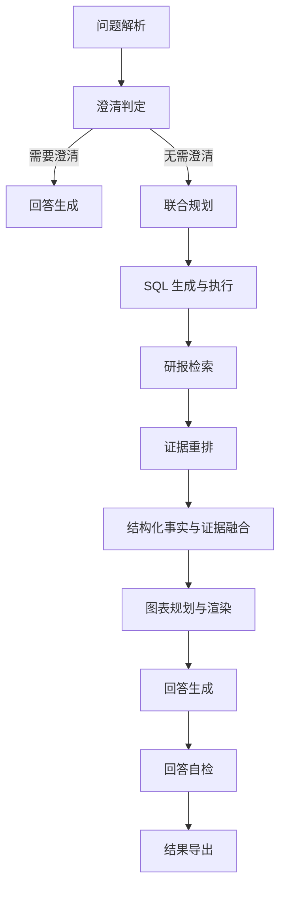

# 6 任务三：基于 RAG、SQL 与状态图协同的研报增强分析系统建模与求解

## 6.1 问题背景

任务三要求系统同时利用结构化财务数据库与非结构化研报知识库，对企业经营状况、行业趋势、政策影响、风险因素和比较关系进行自动分析，并按规定格式输出带引用、可选图表和多轮结构的答案。与任务二相比，任务三的难点不再只是“如何正确查询数据库”，而在于如何将结构化事实与非结构化证据有机融合，使输出既有数量支撑，又有定性解释。

这一任务具有明显的异构证据融合特征。一类问题可以由财务数据库稳定回答，如“营业总收入前十公司”“某公司净利润是否为正”；另一类问题本质上依赖研报观点，如“业绩改善的驱动因素是什么”“行业政策变化带来哪些影响”；更复杂的问题则要求两者同时存在，即先由财务数据完成筛选、排序或趋势确认，再由研报证据解释原因或给出判断依据。

若仅依赖数据库，系统无法回答归因、逻辑和行业判断问题；若仅依赖检索式问答，则又容易缺乏数量支撑，甚至出现无依据幻觉。由此可见，任务三不能被建模为简单的 RAG 问答，也不能被建模为普通 SQL 问数，而应被视为一个“结构化数据、非结构化文本与状态控制共同参与的复合分析问题”。

## 6.2 问题定义与优化目标

设任务一构建的标准化财务数据库为

$$
D=\{r_1,r_2,\dots,r_N\},
$$

其中每条记录均由统一业务键

$$
(\text{stock\_code},\text{stock\_abbr},\text{report\_period},\text{report\_year})
$$

标识。设研报知识库中的 chunk 集合为

$$
K=\{d_1,d_2,\dots,d_M\},
$$

其中每个 chunk 附带标题、来源类型、相对路径、发布时间及图表标题等元数据。设任务三问题集合为

$$
Q=\{q_1,q_2,\dots,q_T\},
$$

任一问题 $q_t$ 包含若干子问题：

$$
q_t=\{u_{t1},u_{t2},\dots,u_{tm}\}.
$$

系统输出可定义为

$$
F(q_t)=\{(c_i,I_i,R_i)\}_{i=1}^{m},
$$

其中 $c_i$ 表示中文回答，$I_i$ 表示图像集合，$R_i$ 表示引用集合。

为了统一描述系统优化方向，记事实正确率为 $Acc$，引用有效性为 $Ref$，多轮一致性为 $Cons$，输出结构完整性为 $Struct$，图表匹配度为 $Chart$，无依据幻觉率为 $Hall$，执行错误率为 $Err$，则可将综合目标写为

$$
\max J=\alpha Acc+\beta Ref+\gamma Cons+\delta Struct+\eta Chart-\mu Hall-\nu Err,
$$

其中各系数均为正。该目标函数的含义是：任务三追求的不只是“有答案”，而是“有依据、有结构、有连贯性且错误率可控”的答案。

## 6.3 整体框架与状态图建模

任务三采用显式状态图进行流程调度。若记系统状态集合为 $S$，动作集合为 $A$，状态转移函数为 $T$，则系统可抽象为

$$
\mathcal{G}=(S,A,T,O),
$$

其中 $O$ 表示最终输出。显式状态图的引入，使得解析结果、查询计划、检索计划、SQL 结果、证据集合、图表计划、当前回答和多轮上下文都可以被显式保存与更新，从而将复杂多轮分析任务拆解为若干可控节点。

系统总体流程如下：

这一设计的重要优势在于：一方面，系统可以根据题型决定是否跳过某些节点，例如纯 SQL 题可以弱化检索，纯行业开放题可以弱化 SQL；另一方面，SQL 错误、证据不足、图表缺失和回答偏差都可以在对应节点被局部修复，而不会直接导致整题失败。

若进一步将每个节点看作对当前状态 $s_t$ 的条件决策，则任务三的求解过程也可以表述为有限步策略序列

$$
\pi=\{\pi_{parse},\pi_{clarify},\pi_{plan},\pi_{sql},\pi_{ret},\pi_{fuse},\pi_{chart},\pi_{ans},\pi_{check}\},
$$

其中每个局部策略都只处理自己负责的不确定性来源。例如，澄清节点主要处理信息不充分的不确定性，SQL 节点主要处理结构化口径与数据库方言的不确定性，检索与重排节点主要处理证据相关性的不确定性，而回答与自检节点则分别处理表达偏差与后验一致性风险。这样的节点化设计使任务三从“单一模型一次性回答”转化为“多阶段不确定性逐层消解”的分析过程。

## 6.4 模型平台与推理组件

任务三采用 OpenAI 兼容接口调用生成模型、向量模型与重排模型，其中生成任务使用大语言模型，知识库表示使用向量模型，证据细排使用重排模型。当前系统的核心组合为：

- 生成模型：`DeepSeek-V3.2`
- 向量模型：`bge-m3`
- 重排模型：`bge-reranker-v2-m3`

设用户问题为 $q$，提示词为 $p_k$，则第 $k$ 个子任务的输出可表示为

$$
y^{(k)}=\operatorname{LLM}(q\mid p_k).
$$

不同节点采用分任务提示和不同约束，其本质是在不同子任务上定义不同的条件生成分布，从而避免在单一巨大输出空间中进行无约束生成。

这一组合并非简单地把三类模型顺序串联，而是对应了任务三求解中的三种能力分解：生成模型负责规划、归纳与表达，向量模型负责在大规模文本空间中建立语义邻近关系，重排模型负责在候选证据中进一步识别“哪些证据最值得被引用”。相较于让单一大模型同时承担全部职责，这种分工更符合研报增强分析任务“先召回、后辨别、再组织”的结构特征，也更有利于在检索质量、回答质量和执行稳定性之间取得平衡。

三者的差异还体现在输出对象和误差类型上。生成模型面对的是高层语义决策问题，其主要风险在于幻觉、主题漂移和结构不稳定；向量模型面对的是大规模召回问题，其主要风险在于语义相似但主体错误的误召回；重排模型面对的是候选排序问题，其主要风险在于把“表面相关但证据力度不足”的文本排到前列。正因为三类任务的目标函数并不相同，系统才有必要采用异构模型分工，而不是依赖单一模型端到端包揽全部过程。

从工程链路看，任务三中的模型调用也具有明显分层。生成模型主要服务于解析、规划、回答和自检等高层节点；向量模型服务于知识库向量化和初步检索；重排模型则作用于较小候选集上的证据精排。这样的调用顺序可以写为

$$
q \xrightarrow{\text{embed}} \mathcal{D}_0 \xrightarrow{\text{rerank}} \mathcal{D}^* \xrightarrow{\text{LLM}} A,
$$

其中 $\mathcal{D}_0$ 为初召回候选集，$\mathcal{D}^*$ 为重排后的高质量证据集，$A$ 为最终回答。该流程意味着任务三并不是让大模型直接“记住全部研报”，而是先通过检索压缩证据空间，再让大模型在受限证据集上完成分析与表达。

## 6.5 研报知识库构建

### 6.5.1 文本切分与噪声抑制

任务三首先对研报 PDF 进行正文抽取、页面清洗与 chunk 切分。与固定窗口切分不同，系统尽量沿标题、段落和图表说明边界进行切分，以保留完整语义单元。若将研报文本序列记为

$$
X=\{x_1,x_2,\dots,x_n\},
$$

则 chunk 构建过程可看作寻找切分点集合

$$
\Pi=\{b_0,b_1,\dots,b_m\},\quad 0=b_0<b_1<\cdots<b_m=n,
$$

从而得到

$$
d_j=(x_{b_{j-1}+1},\dots,x_{b_j}).
$$

这一过程并非单纯的长度控制，更重要的是保留图表标题、分析段落和主题语句，使单个 chunk 对行业判断和企业归因问题具有更强解释力。

从文本建模角度看，切分质量直接决定了检索质量的上限。若 chunk 过长，则一个片段内部往往混杂多个主题，向量表示会被平均化，导致检索时“看起来都相关但都不够精准”；若 chunk 过短，则因果链条、比较关系和图表说明会被人为切断，导致系统虽然召回到局部关键词，却无法获得完整证据。因此，当前切分策略强调“语义完整性优先于长度均匀性”，尽可能沿标题、段落和图表说明边界进行切分。

噪声抑制同样是该模块的重要组成部分。研报 PDF 中常包含页眉页脚、免责声明、目录、版权声明和重复页码等与分析无关的信息，若这些内容进入知识库，不仅会降低向量空间纯度，还会在召回阶段占据本应属于正文分析的候选名额。因此，当前系统在切分前会先剔除高频模板噪声，再进入正文级切片。这一做法本质上是在优化知识库的信噪比，使后续检索更倾向于返回“包含分析价值的证据片段”，而不是“形式上与问题共享若干词面的非正文文本”。

进一步地，任务三中的许多问题并不只依赖单句事实，而依赖“结论 + 解释 + 图表标题”这一更完整的语义单元。正因为如此，当前切分策略并未把图表标题视为独立边角信息，而是尽量与相邻分析文字共同保留，使系统在后续引用中既能说明证据来自哪份研报，也能说明对应的是哪张图、哪张表以及围绕该图表的分析语境。

### 6.5.2 元数据标准化

除文本内容外，系统还对研报标题、发布日期、机构名称、公司或行业归属、图表标题等信息进行标准化。这一层元数据在后续检索中具有重要作用，因为大量问题在初始阶段并非依赖语义近邻，而首先依赖“公司一致”“行业一致”或“主题一致”的高精度过滤。

从知识组织角度看，经过标准化后的知识库不再只是若干文本片段的集合，而更接近一个“以证据为索引单元的分析资料库”。文本内容提供可引用的事实和观点，元数据则提供证据定位、证据过滤与证据追踪的坐标系。正是因为存在这一层坐标系，系统才能在回答中稳定给出来源、图表标题与对应证据片段，而不是退化为仅凭语义相似度拼接出的无出处摘要。

元数据标准化还承担了跨文档对齐的作用。不同机构、不同时间发布的研报在标题习惯、公司简称、日期格式和行业标签上往往并不统一，如果缺乏标准化，同一家公司或同一主题就可能在知识库中被割裂为多个不相连的局部簇。当前系统通过统一公司别名、规范日期表达、归一化图表标题和来源类型，使知识库在语义层之外又建立起一层结构化索引，从而为“按公司过滤”“按行业过滤”“按时间排序”和“按图表标题引用”提供稳定支撑。

从信息检索理论看，这一步相当于在向量空间之外增加了一个离散约束空间。向量表示擅长处理近义、隐含和主题相似问题，而元数据更擅长处理主体一致、时间一致和来源一致问题。二者结合后，任务三才能同时获得较高召回率与较高证据精度，这也是混合检索能够优于纯向量检索的重要原因。

## 6.6 混合检索模型

任务三采用“元数据检索 + 向量检索 + 重排”的三级检索机制。设问题为 $q$，公司集合为 $\mathcal{C}$，主题集合为 $\mathcal{Z}$，则元数据检索得分可抽象为

$$
S_{\text{meta}}(d\mid q)=a_1\mathbf{1}(d\ \text{命中公司})+a_2\mathbf{1}(d\ \text{命中主题})+a_3\mathbf{1}(d\ \text{命中行业范围})+a_4\text{TokenMatch}(q,d).
$$

向量检索得分为

$$
S_{\text{vec}}(d\mid q)=\frac{\mathbf{q}^{\top}\mathbf{d}}{\|\mathbf{q}\|_2\|\mathbf{d}\|_2}.
$$

两者融合后的候选得分写为

$$
S_{\text{hyb}}(d\mid q)=\alpha S_{\text{meta}}(d\mid q)+\beta S_{\text{vec}}(d\mid q),
$$

其中 $\alpha,\beta>0$。这一融合策略体现了“先高精度过滤，再用语义补召回”的思想：在金融研报场景中，主体对齐往往比纯语义相似更重要，否则容易召回主题相近但主体错误的研报。

在此基础上，系统再通过重排模型对候选集合 $\mathcal{D}'$ 进行语义细排：

$$
\pi^*=\arg\max_{\pi}\sum_{k=1}^{K}S_{\text{rerank}}(d_{\pi_k}\mid q).
$$

这一步的作用不是简单保留最高相似度文本，而是保留“最贴近问题、信息最具体且来源多样”的证据组合。

从检索机理上看，混合检索之所以适合研报分析场景，是因为此类问题同时具有“主体约束强”和“语义表达自由”两重特征。仅依赖元数据检索，容易漏掉表达方式差异较大的高价值证据；仅依赖向量检索，则又容易召回主题近似但主体错误的片段。当前体系通过把主体一致性约束与语义近邻约束叠加到同一候选评分函数中，实质上是在显式平衡 precision 与 recall。

进一步地，重排模型在这里并不是锦上添花，而是解决“初召回足够多但证据顺序不可靠”的关键一环。对于很多开放分析题而言，真正有价值的不是召回到了多少段文本，而是前几段文本是否已经覆盖了最核心的判断依据、最直接的图表说明和最贴近题意的分析措辞。因此，重排阶段所优化的并不是简单的相关性，而是“证据可引用性”和“证据解释力”。这也是为什么当前系统在回答生成前一定要先完成证据重排，而不是直接把初召回结果送入生成节点。

如果把整个过程写成一个多阶段筛选器，则可表示为

$$
K \xrightarrow{f_{meta}} \mathcal{D}_{meta} \xrightarrow{f_{vec}} \mathcal{D}_{hyb} \xrightarrow{f_{rerank}} \mathcal{D}^{*},
$$

其中 $f_{meta}$ 负责硬约束过滤，$f_{vec}$ 负责语义召回补充，$f_{rerank}$ 负责证据强度排序。该结构使任务三的检索不再是单次相似度查询，而更接近一个带有多层判别机制的证据发现过程。

### 6.6.1 检索范围决策

任务三中的检索并非始终面向同一知识域，而是需要根据问题语义决定当前应优先检索个股研报、行业研报还是二者混合。若记检索范围集合为

$$
\mathcal{S}=\{\text{stock},\text{industry},\text{hybrid}\},
$$

并将问题的主题特征、公司特征和解释需求记为 $\xi(q)$，则检索范围选择可表示为

$$
s^*(q)=\arg\max_{s\in\mathcal{S}}Score_{scope}(\xi(q),s).
$$

当问题明确指向某家企业或某组企业的经营表现时，系统倾向选择 `stock` 范围；当问题关注医保谈判、集采、产业趋势和价格波动等行业层面主题时，系统倾向选择 `industry` 范围；而当问题同时要求“定量筛选 + 定性归因”时，系统则转向 `hybrid` 范围。该设计的理论意义在于，它避免了检索阶段盲目扩大候选空间，从而减少无关证据对后续回答的扰动。

## 6.7 统一财务视图与季度口径派生

任务三并不直接对多张基础财务表进行自由 join，而是依托统一财务视图。设利润表、资产负债表、现金流量表和核心指标表分别为

$$
T_{inc},\ T_{bal},\ T_{cf},\ T_{core},
$$

则统一视图记为

$$
V=T_{inc}\Join T_{bal}\Join T_{cf}\Join T_{core}.
$$

统一视图使系统能够在单一数据平面上完成财务查询，并继承任务一已经完成的标准化成果。

此外，任务三同样需要处理 `Q2`、`Q4` 和“同期”问题，因此系统引入单季度派生规则。设某指标为 $X$，则有

$$
X_{Q2}=X_{H1}-X_{Q1},
$$

$$
X_{Q4}=X_{FY}-X_{Q3},
$$

$$
X_{Q3}^{(single)}=X_{Q3}^{(cum)}-X_{H1}^{(cum)}.
$$

对“同期”问题，系统进一步执行同口径映射：

$$
\text{SamePeriod}(YQ3)= (Y-1)Q3,\qquad \text{SamePeriod}(YFY)=(Y-1)FY.
$$

这一设计保证了多轮追问中“同期”“去年”“上年同期”等表述能够稳定映射到正确报告期。

事实上，这一机制可以被理解为财务分析中“可比性原则”的程序化实现。企业经营判断之所以需要映射到同口径、同周期的比较基准，正是因为脱离可比边界的数字并不能支撑有效解释。将“同期”“去年”“上年同期”等自然语言表达稳定还原为标准报告期，不只是为了方便 SQL 查询，更是为了保证后续同比、趋势与经营变化分析具有一致的经济含义。

## 6.8 节点设计与模块优化

### 6.8.1 问题解析节点

问题解析节点负责抽取公司、股票代码、指标、主题词、报告期、TopN 和阈值，并进一步判断题型路由。设问题文本为 $u$，其解析结果可记为

$$
P(u)=\{\mathcal{C},\mathcal{T},\mathcal{M},\mathcal{Z},n,\theta,\rho\},
$$

其中 $\rho$ 表示题型路由。当前系统支持纯结构化查询、图表查询、归因分析、行业开放分析和混合分析等多种路由。

该节点的关键优化在于：一是强化了公司别名、指标别名和报告期别名的标准化能力；二是增强了对多轮指代的识别，使“这些公司”“上述企业”“其中”“判断依据是什么”等追问能够自动继承上轮上下文。

因此，解析节点在任务三中承担的并不只是实体抽取功能，更是整个求解流程的路由入口。它既决定问题应进入何种信息通道，也决定后续节点应继承哪些历史上下文、忽略哪些表面词面噪声。换言之，解析的输出不仅是“识别出了什么”，更是“系统接下来应该如何思考和执行”。

### 6.8.2 澄清节点

澄清节点并非机械地在信息缺失时一律追问，而是根据题型判断哪些槽位是真正必要的。设关键槽位集合为

$$
\Omega=\{\text{company},\text{period},\text{metric}\},
$$

则澄清触发规则可表示为

$$
Clarify(u)=
\begin{cases}
1,& \Omega_{req}\setminus\Omega_{obs}\neq\varnothing,\\
0,& \text{otherwise}.
\end{cases}
$$

但在实际中，系统会对筛选题、开放题和多轮追问题型进行豁免，以减少不必要的交互开销。

### 6.8.3 联合规划节点

任务三并不将 SQL 规划与检索规划完全分离，而是优先在同一规划阶段同时决定“是否需要 SQL”和“是否需要研报证据”。设规划函数为

$$
(\Pi_q,\Pi_r)=\Psi(u,P(u),H_{t-1}),
$$

其中 $H_{t-1}$ 表示历史上下文。联合规划的价值在于：它能够在问题进入执行层之前先确定当前题究竟是结构化为主、检索为主，还是两者并重，从而减少不必要的检索或冗余 SQL。

这种联合规划的优势在于避免结构化链路与检索链路各自独立决策后再被动拼接。若二者分别规划，常见风险是 SQL 已经锁定某种筛选范围，而检索却召回另一套主体；或者检索已经表明缺乏支持证据，而 SQL 仍继续给出看似完整的名单。提前在同一规划层协调两类信息需求，有助于保证后续结构化事实与非结构化证据在主体、时间和问题目标上的一致性。

### 6.8.4 SQL 生成与执行节点

任务三的 SQL 生成遵循严格的安全约束。设允许的 SQL 空间为

$$
\mathcal{S}_{safe}=\{s\mid s\ \text{仅含 SELECT/WITH 且仅查询统一财务视图}\},
$$

则大模型输出 $\hat{s}$ 必须满足

$$
s^*=\operatorname{Proj}_{\mathcal{S}_{safe}}(\hat{s}).
$$

当前系统在该节点上做了三类关键优化：

1. 增加 SQLite 方言约束，避免不兼容语法；
2. 在执行报错后尝试方言修复，降低“假空结果”；
3. 对结构化 schema 不支持的业务主题字段设置显式边界，禁止模型用模糊条件伪造结果。

这一设计使任务三的 SQL 生成更像“受限程序生成”，而非自由文本生成。

这里的关键并不在于让 SQL 尽可能复杂，而在于让 SQL 尽可能可信。对于任务三而言，结构化查询的职责是提供可靠数量事实，而不是在数据库模式并不支持的情况下勉强拼接出“貌似合理”的筛选逻辑。因此，系统宁可在业务字段缺失时诚实收口，也不允许模型通过模糊匹配或自造条件伪造细分业务答案。这种保守策略虽然牺牲了少量表面覆盖率，却显著提升了整体结果的可复核性。

### 6.8.5 检索与证据重排节点

检索节点根据问题类型和规划结果决定检索范围为公司研报、行业研报或混合范围，并进一步决定是否执行完整重排。对于简单事实题或纯 SQL 题，系统可以弱化重排以降低延迟；对于归因题和开放分析题，则保留完整重排以提升证据质量。

此外，当前版本引入了证据先导过滤机制。对于必须先由研报证据确认对象集合的问题，若检索阶段无法形成可靠对象集合，则系统宁可保守回答，也不再勉强沿用结构化数据给出看似完整但缺乏依据的名单。

从证据论证角度看，这一机制实际上是在区分“结构化事实充分但解释证据不足”和“解释证据充分但结构化事实不足”两类情形。前者适合输出“结论明确、解释保守”的回答，后者则适合输出“逻辑可解释、数量证据不足”的回答。这样的分流比简单要求“SQL 与研报必须同时齐全”更符合实际分析场景。

### 6.8.6 回答生成节点

回答生成并非直接把 SQL 行和证据文本交给模型，而是在运行时先做事实清洗和数值列选择。若将结构化事实集合记为 $\mathcal{F}$，研报证据集合记为 $\mathcal{E}$，则回答生成本质上是在构造

$$
A=\Phi(q,\mathcal{F},\mathcal{E}),
$$

其中 $\Phi$ 必须满足两个原则：

1. 所有数字必须来自 $\mathcal{F}$ 或显式计算；
2. 所有定性结论必须来自 $\mathcal{E}$ 或被明确标注为缺乏直接证据。

围绕该目标，系统对回答节点做了多项优化，包括过滤标识符列、引入问题驱动的指标列优选、为简单事实题设置确定性短路径，以及对“数据来源是否可靠”“同期”等多轮追问自动继承上轮上下文。

进一步地，若把结构化证据权重记为 $\lambda_f$，非结构化证据权重记为 $\lambda_e$，则在不同题型下，回答融合策略可以写为

$$
A=\Phi(q,\mathcal{F},\mathcal{E};\lambda_f,\lambda_e),\qquad \lambda_f+\lambda_e=1.
$$

对于数值判定、排序和筛选题，$\lambda_f$ 应明显大于 $\lambda_e$；对于归因和行业解释题，$\lambda_e$ 应适当提高；而在“先筛选后解释”的混合题中，两者则需保持相对均衡。虽然当前系统并未显式学习该权重，但其通过题型路由、联合规划和提示词分层，在规则层面近似实现了这一加权思想。

### 6.8.7 图表节点

对要求绘图的问题，系统会先生成结构化图表规范，再由图表模块进行渲染。设图表计划为

$$
C=(\text{chart\_type},x,y,\text{title},\text{unit}),
$$

则图表规范可视为对图表表达空间的中间表示。该设计将“图表语义决策”与“绘图执行”解耦，从而提升图表生成的稳定性。

在任务三中，图表也不应被理解为文本回答的装饰物。对于比较不同公司、呈现趋势变化或辅助解释行业结构的问题，图像实际上承担了与文本并行的证据表达功能。文本适合压缩结论、交代逻辑链条，图表则更擅长展示相对差异、排序结构和时间演化。因此，将图表节点单独建模，有助于系统在复杂分析题中形成更完整的多模态论证结构。

### 6.8.8 回答自检节点

回答生成后，系统还会执行一致性复核。设回答为 $A$，结构化事实为 $\mathcal{F}$，证据集合为 $\mathcal{E}$，则自检函数可写为

$$
Check(A,\mathcal{F},\mathcal{E})\rightarrow \{\text{pass},\text{notes}\}.
$$

其检查内容包括：数字是否与 SQL 一致、是否错误引用不存在证据、是否遗漏关键问题点、是否混淆指标名称，以及是否把聚合结果误映射到具体公司。该节点为任务三提供了重要的后验纠偏能力。

## 6.9 提示词工程的分层设计

提示词工程是任务三方法设计中的核心组成部分，而非外围实现细节。由于系统同时涉及解析、规划、SQL、检索、回答和复核等多种子任务，若使用单一总提示词，不同目标会彼此干扰，导致输出空间过于松散。因此，本文采用分层提示词体系。设提示词集合为

$$
\mathcal{P}=\{p_{plan},p_{qplan},p_{rplan},p_{sql},p_{clarify},p_{rerank},p_{ans},p_{check}\}.
$$

则各节点输出为

$$
y^{(k)}=\operatorname{LLM}(x^{(k)}\mid p_k).
$$

### 6.9.1 规划类提示词

规划类提示词的目标不是直接回答问题，而是把自然语言问题先投影到中间结构空间：

$$
q\rightarrow (\Pi_q,\Pi_r).
$$

其本质是向模型注入结构先验，使模型先判断问题需要什么类型的信息，再决定进入何种求解路径。

### 6.9.2 SQL 提示词

SQL 提示词在任务三中承担的是“受限程序生成”角色。它通过显式写入数据库方言、报告期标准、公司枚举限制、业务主题边界和季度口径规则，将开放式生成问题约束为可执行 SQL 子空间中的搜索问题。这一约束对减少 SQL 幻觉和假空结果具有决定性作用。

### 6.9.3 澄清提示词

澄清提示词强调以最小交互成本补足关键信息。若记额外交互成本为 $C_{ask}$，因信息不足引起的误答成本为 $C_{miss}$，则澄清机制隐含地在优化

$$
\min (C_{ask}+\lambda C_{miss}).
$$

这意味着系统不追求“问得越多越好”，而追求“在尽可能少的追问下获得足够可靠的求解条件”。

### 6.9.4 证据重排提示词

证据重排提示词的目标是帮助系统从初步召回的候选中保留最值得引用的证据。它并不生产新知识，而是在候选证据中执行优先级排序，从而减少回答阶段对低相关噪声文本的依赖。

### 6.9.5 回答提示词

回答提示词强调证据约束和概念克制，其核心要求是：数字必须来自结构化事实，定性分析应优先使用研报证据，若没有证据则必须显式说明，不允许用营业总收入替代细分业务收入，不允许把统计结果误写成个体结论。该设计使系统输出更接近于有依据的分析报告，而非自由发挥的生成文本。

这一提示策略的理论价值在于，它将回答生成从“自由语言建构”转化为“证据约束下的文本组织”。换言之，模型的职责不再是凭借先验知识直接补全因果链条，而是在给定结构化事实和研报证据的条件下，对可接受结论空间进行有约束的重组。对于金融分析任务而言，这种收缩尤为重要，因为看似自然的措辞若缺乏对应证据，往往会被评审视为不可靠的幻觉推断。

### 6.9.6 自检提示词

自检提示词相当于在回答之后再放置一道质量阀门。其作用不是重新生成内容，而是对已有回答进行后验审查，从而降低小概率但高风险的错写现象。

从可靠性增强角度看，任务三的提示词工程实际上形成了“生成前约束、生成中收缩、生成后复核”的三层结构。若记无约束输出空间为 $\mathcal{Y}$，经规划、SQL、回答和自检多层提示后得到的有效输出空间为 $\mathcal{Y}^{*}$，则有

$$
\mathcal{Y}^{*}\subset \mathcal{Y}.
$$

也就是说，提示词工程在任务三中的作用并不是单纯提升语言流畅性，而是通过连续收缩可接受输出空间，提升结果的可验证性、可解释性与整体可靠性。

值得强调的是，任务三中的提示词工程并不是“把同一套提示复制到多个节点”，而是针对不同子任务构造不同的行为契约。规划类提示词强调结构化决策与题型路由，SQL 提示词强调数据库边界与方言限制，澄清提示词强调最小交互成本，重排提示词强调证据优先级，回答提示词强调事实与证据分层，自检提示词则强调后验一致性。换言之，提示词在这里更接近一组分布式控制器，而非单一风格模板。

这种设计的学术意义在于，它把原本难以显式程序化的高层约束，转化为可由模型理解和执行的条件先验。设第 $k$ 个节点的可接受输出集合为 $\mathcal{Y}_k^{acc}$，则提示词的作用可以理解为引导模型输出满足

$$
y^{(k)} \in \mathcal{Y}_k^{acc},
$$

而不是在全体语言空间内自由搜索。对于任务三这样一个同时涉及数据库事实、研报证据、图表协议和多轮上下文的复杂系统来说，这种基于提示词的软约束机制，恰好弥补了“纯规则太僵硬、纯生成太松散”之间的空白。

此外，提示词工程还与状态图中的节点边界形成了强耦合关系。正是因为每个节点都只承担有限职责，提示词才能被写得足够明确；反过来，也正是因为提示词把职责约束得足够明确，状态图中的节点才不会在执行中互相侵入。可以说，任务三的稳定性来自“状态图定义流程边界，提示词定义节点行为”这两层机制的共同配合。

## 6.10 输出协议与结构化结果

任务三最终输出采用多轮结构：

$$
\texttt{list}[\{Q,A\}],
$$

其中

$$
A=\{\texttt{content},\texttt{image},\texttt{references}\}.
$$

进一步地，每条引用为

$$
r=(\texttt{paper\_path},\texttt{text},\texttt{paper\_image}).
$$

这一协议的意义在于：`content` 负责结论表达，`image` 负责图像结果，`references` 负责证据链保存。特别是 `paper_image` 采用图表标题文本而非图片路径，使引用不仅能说明“证据来自哪份研报”，还能说明“证据对应哪张图或哪张表”，从而增强评审可读性和证据指向性。

从输出规范角度看，该协议实际上完成了结论层、展示层与证据层的显式分离。`content` 回答“系统得出了什么判断”，`image` 回答“哪些可视化结果可以辅助理解”，`references` 回答“上述判断依据何在”。这种分层表达既满足了竞赛提交格式的工程需求，也使结果更接近正式分析报告中的“观点—图示—出处”三段式组织方式。

## 6.11 优化过程与主要改进

任务三的优化主要沿着以下几个方向展开：

1. 通过 SQL 方言修复消除 SQLite 兼容性问题，减少假空结果；
2. 通过标识符过滤与指标列优选，修复把股票代码当金额等严重数值错位问题；
3. 通过结构化边界收口，避免对 schema 中不存在的细分业务指标进行伪回答；
4. 通过多轮上下文继承和“同期”映射，增强追问一致性；
5. 通过统一引用协议和路径规范，稳定最终提交结构；
6. 通过证据重排与回答自检，降低定性分析中的无依据扩张。

这些改进共同推动任务三从“能够产出答案”发展为“能够稳定产出、结构正确且相对可信的答案”。

若按迭代顺序观察，这些优化并不是并列发生的，而是沿着“先消除致命错误，再收紧语义边界，最后改善表达质量”的路径逐步推进。最初需要解决的是 SQL 方言不兼容、路径协议不统一和结构字段不齐等执行层问题；在执行层稳定后，优化重点转向股票代码误读为数值、期间映射错误、无 schema 支持的细分业务口径被伪回答等语义层问题；待语义层收缩后，系统才进一步优化多轮承接、回答措辞、引用组织和图文一致性等表达层问题。

这种优化顺序并非偶然，而是符合复杂智能系统的收敛规律：如果执行层仍不稳定，再精细的提示词和证据策略也无法稳定落地；如果语义边界仍然模糊，则再自然的回答也可能只是“把错误说得更流畅”。因此，任务三当前版本之所以能够达到较高稳定性，并不是因为某个单独模块特别强，而是因为多个模块经历了由底向上的逐层收口。

从模块对应关系看，当前优化至少覆盖了以下五类关键部件：解析与路由模块负责减少问题理解偏差，SQL 与运行时模块负责减少结构化执行风险，检索与重排模块负责提升证据质量，回答与自检模块负责抑制表达性幻觉，输出协议模块负责保证提交格式与引用链稳定。正是这些模块在同一工作流中的协同优化，使任务三逐渐从“会答题”提升为“能以可追踪方式完成分析任务”。

如果把这些优化进一步归类，可以看到它们大致对应三类风险控制目标：其一是执行风险控制，即减少 SQL 方言错误、路径错误和结构协议错误；其二是语义风险控制，即减少指标错位、期间混淆、主题越界和证据主体不一致；其三是表达风险控制，即减少回答中无依据扩张、图文脱节和多轮承接失焦。正是这三类风险的同步收缩，使任务三逐步从“可运行系统”向“可提交系统”逼近。

## 6.12 结果分析

在最终正式版结果中，任务三共完成问题 80 道，达到

$$
N_{ok}=80,\qquad N_{err}=0.
$$

若以总体成功率表示，则有

$$
Acc_{all}=\frac{80}{80}=100\%.
$$

与此同时，系统知识库已形成稳定规模，向量索引处于可直接检索状态。这说明任务三已经不再停留在“原型可用”的阶段，而是具备了完整的运行闭环：既能完成结构化财务查询，也能完成研报检索、证据重排、图表生成与结构化导出。

更重要的是，任务三当前版本的提升并非来自单个模型回答能力的偶然波动，而是来自三类系统性改进。其一，SQL 方言修复和结构化边界收口减少了“假空结果”和“伪结构化回答”；其二，多轮上下文继承和相对期间映射提高了追问稳定性；其三，证据重排、回答约束和自检提示共同提升了定量与定性信息融合时的可靠性。

从分析质量角度看，当前系统已经能够较好地建立“数据库给出数量事实、研报提供逻辑解释、状态图控制整体流程”的协同关系。也就是说，任务三的关键成果并不是简单把 SQL 与 RAG 叠加，而是实现了结构化事实、非结构化证据和流程控制三者之间的功能分工与信息闭环。这也是其区别于普通 SQL 问答系统和普通检索式问答系统的关键所在。

如果从可靠性来源进一步拆分，可以将任务三当前结果的稳定性归纳为三个层级。第一层是数据层稳定性，即统一财务视图和标准化知识库保证了底层输入的可复用性；第二层是流程层稳定性，即状态图使澄清、规划、执行、检索、回答和自检的职责边界更加清晰；第三层是表达层稳定性，即分层提示词和回答协议共同约束最终输出结构。三者叠加后，系统不再依赖单次模型“灵感式发挥”，而是更多依赖流程与约束本身提供稳定性。

当然，当前系统仍然存在边界。首先，若问题要求的细分业务口径在结构化数据库和研报文本中都缺乏直接证据，则系统只能给出保守的边界说明，而无法强行完成高置信度定量回答。其次，多篇研报之间若存在显著观点冲突，当前系统虽能通过重排保留高相关证据，但尚未显式建模“观点冲突的比较与裁决”过程。再次，开放分析题中定量事实与定性证据的权重目前仍主要依赖规则和提示词控制，尚未发展为可学习的自适应融合模型。

尽管如此，就当前赛题要求而言，任务三已经较好完成了“数量分析 + 文本解释 + 引用支撑”的联合求解任务，并具备较强的提交稳定性。

需要指出的是，当前结果的价值并不只体现在“80 题全部输出为 ok”这一表面统计上，更体现在系统已经形成了较稳定的分析范式：先由结构化数据库给出数量事实边界，再由研报证据补足解释链条，最后通过状态图、提示词和输出协议把两类信息组织成可追踪的答案。这意味着任务三已经不再是单纯的问答器，而更接近一个面向行业研究场景的原型分析智能体。

## 6.13 本题小结

本文将任务三建模为一个由 RAG、SQL 与显式状态图共同驱动的研报增强分析系统。该系统通过统一财务视图、混合检索、联合规划、提示词分层、图表表达与回答自检等多项机制，将原本松散的多轮分析问题转化为一条结构清晰、可追溯、可复核的求解链路。实验与迭代结果表明，这种“结构化数据 + 非结构化证据 + 状态控制”的建模路线，能够较好地满足赛题对准确性、解释性和稳定性的综合要求。
