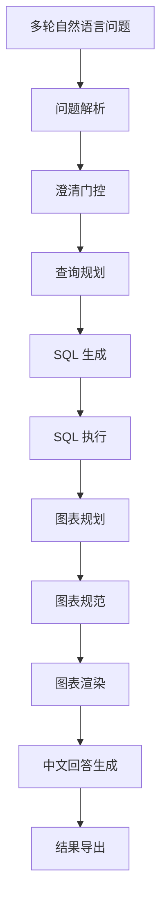

# 5 任务二：基于 LangGraph 的财务智能问数系统建模与求解

## 5.1 问题背景

任务二要求系统面向附件 4 中的多轮自然语言问题，基于任务一构建的结构化财务数据库自动完成问题理解、财务口径判定、数据库查询、图表生成与中文回答输出。该问题表面上属于自然语言转 SQL 的问答任务，但从赛题要求来看，其本质更接近于一种“金融语义约束下的多轮结构化决策问题”。

一方面，问题中大量出现“这些公司”“上述企业”“其中哪家”等指代形式，说明任务二并非独立的单轮问答，而是具有显著的上下文依赖。另一方面，财务指标本身具有明确的会计定义和披露口径，单季度值、累计值、同比、环比、金额单位与比例单位之间均不能随意混用。若仅依赖大模型直接端到端生成回答，则容易出现三类典型误差：其一是多轮上下文继承失败，导致前后轮逻辑断裂；其二是 SQL 语句虽形式正确却与实际数据库方言或字段口径不匹配；其三是在结果为空或底层数据覆盖不足时，系统无法做出经济上合理的解释。

基于上述特点，本文并未将任务二建模为单纯的开放式生成问题，而是将其视为一个由状态管理、约束推理、数据库检索和可视化表达共同组成的复合求解过程。换言之，模型的目标不是“生成一句看似合理的话”，而是在每一道题上形成一条完整且可复核的处理链路：从问题解析到查询规划，再到 SQL 执行、结果后处理、图表生成和文本回答，均需满足财务语义一致性和结果可解释性要求。

## 5.2 问题定义与建模目标

设任务一输出的财务数据库记为

$$
D=\{r_1,r_2,\dots,r_N\},
$$

其中每条记录 $r_i$ 均由统一业务键

$$
(\text{stock\_code},\text{report\_period},\text{report\_year})
$$

标识，并包含利润表、资产负债表、现金流量表以及核心指标表的标准化字段。设任务二问题集合为

$$
Q=\{q_1,q_2,\dots,q_M\},
$$

其中任一问题 $q_j$ 可以拆分为若干子问题：

$$
q_j=\{u_{j1},u_{j2},\dots,u_{jk}\}.
$$

系统对每个问题 $q_j$ 的输出定义为

$$
F(q_j)=(s_j,c_j,a_j),
$$

其中 $s_j$ 表示可执行 SQL，$c_j$ 表示图表格式或图表规范，$a_j$ 表示符合竞赛提交要求的中文回答。

进一步地，任务二的建模目标可表述为：在保证财务口径一致性与语义连贯性的前提下，使系统输出尽可能准确、稳定且具备可解释性。若以回答正确性、格式完整性、图表匹配度和多轮稳定性分别记为 $Acc$、$Fmt$、$Chart$ 和 $Stable$，以 warning 比例和 error 比例分别记为 $Warn$ 和 $Err$，则可将综合优化目标写为

$$
\max J=\alpha Acc+\beta Fmt+\gamma Chart+\delta Stable-\mu Warn-\nu Err,
$$

其中 $\alpha,\beta,\gamma,\delta,\mu,\nu > 0$ 为权重系数。该目标函数不用于端到端训练，而是作为系统优化与回归验证的评估准则。

## 5.3 总体框架

考虑到任务二同时涉及自然语言理解、金融数据库查询和结果表达，本文采用“显式状态图 + 大模型规划 + 规则回退”的混合求解框架。系统总体流程如图所示：

从实现机制上看，上述流程由 `LangGraph` 管理状态迁移，核心状态变量包括：当前问题、累计问题、已解析槽位、缺失槽位、查询计划、SQL 执行结果、上下文公司集合、上下文结果行、图表计划、图表规范以及多轮回答缓存等。因此，任务二并非黑盒式的“问一句答一句”，而是一个显式状态转移系统。若记系统状态集合为 $S$，动作集合为 $A$，状态转移函数为 $T$，则任务二可以抽象为

$$
\mathcal{M}=(S,A,T,O),
$$

其中 $O$ 表示最终输出。这样的建模方式为后续的规则注入、调试诊断和回归验证提供了必要的结构基础。

## 5.4 大模型平台与推理配置

任务二采用 OpenAI 兼容接口形式调用大模型，当前正式环境中接入的平台为 **SiliconFlow**，所使用的核心模型为

$$
\texttt{deepseek-ai/DeepSeek-V3.2}.
$$

系统通过 `TASK2_LLM_BASE_URL`、`TASK2_LLM_API_KEY` 和 `TASK2_LLM_MODEL` 三项环境配置完成模型调用。根据任务类型的差异，系统采用分层温度策略：在查询规划与 SQL 生成阶段使用

$$
T=0.0,
$$

以保证结构化输出的稳定性；在澄清问题与中文回答生成阶段使用

$$
T=0.2,
$$

以在事实约束下保留适度的语言自然性。这一设置遵循了“结构化决策低温、语言表达中低温”的原则，使大模型既能承担语义规划任务，又不会在 SQL 生成中引入过多随机性。

## 5.5 统一财务视图构建

任务二并不直接面向任务一数据库中的四张基础表逐表查询，而是首先构建统一宽表视图 `financials_view`。设利润表、资产负债表、现金流量表和核心指标表分别为

$$
T_{inc},\quad T_{bal},\quad T_{cf},\quad T_{core},
$$

则统一视图可形式化写为

$$
V=T_{inc}\Join T_{bal}\Join T_{cf}\Join T_{core},
$$

其中连接键统一为

$$
(\text{stock\_code},\text{stock\_abbr},\text{report\_period},\text{report\_year}).
$$

统一视图的构建具有三方面意义。其一，它将多表联合查询简化为单视图查询，显著降低了 SQL 生成复杂度；其二，它继承了任务一中已经完成的字段融合逻辑，避免同义字段在任务二再次分散处理；其三，它使得后续图表规划、空结果解释和结果校验均可在同一数据平面上完成。

在此基础上，系统进一步引入派生单季度记录。由于我国上市公司季报常按 `Q1 / H1 / Q3 / FY` 披露，而题目中却可能直接询问 `Q2` 或 `Q4` 的单季度值，故需通过累计值差分恢复单季度值。设某指标记为 $X$，则有

$$
X_{Q2}=X_{H1}-X_{Q1},
$$

$$
X_{Q4}=X_{FY}-X_{Q3}.
$$

若问题要求第三季度相对于第二季度的环比，则还必须注意第三季度常以累计口径披露，因此第三季度单季值应写为

$$
X_{Q3}^{(single)}=X_{Q3}^{(cum)}-X_{H1}^{(cum)}.
$$

这一处理直接解决了季报问答中最容易出现的口径错误，即将“累计值”误判为“单季度值”。在任务二的优化过程中，`B1034` 的修复正是基于这一原理完成的。

## 5.6 意图解析与槽位表达

任务二首先将自然语言问题映射为结构化槽位。对任一子问题 $u$，解析器输出为

$$
P(u)=\{\mathcal{C},\mathcal{T},\mathcal{M},n,\theta,g\},
$$

其中 $\mathcal{C}$ 表示公司集合，$\mathcal{T}$ 表示报告期集合，$\mathcal{M}$ 表示指标集合，$n$ 表示排名参数，$\theta$ 表示阈值，$g$ 表示图表类型。

本质上，这一步是一个领域化语义归一化过程。若原始词面集合记为 $\mathcal{W}$，系统支持的标准指标集合记为 $\mathcal{M}^*$，则解析器执行的是映射

$$
\phi:\mathcal{W}\rightarrow \mathcal{M}^*.
$$

为了与任务一最终字段体系保持一致，系统在优化过程中补充了多组指标别名映射。例如：

- “扣非净利润”与“扣除非经常性损益后的净利润”统一映射到 `net_profit_excl_non_recurring`；
- “加权平均净资产收益率（扣非）”“扣非净资产收益率”“扣非 ROE”统一映射到 `roe_weighted_excl_non_recurring`；
- “销售费用”映射到 `operating_expense_selling_expenses`。

这一改进的意义在于，规划层的语义理解不再停留在自然语言层面，而能够稳定地落到数据库字段层面，从而减少“问题理解正确但 SQL 无法落地”的情况。

## 5.7 澄清门控机制

并非所有问题在初始输入时都具备完整的查询条件。对于信息不足的问题，系统首先进行澄清判定。记关键槽位集合为

$$
\Omega=\{\text{company},\text{period},\text{metric}\},
$$

当问题所需槽位集合 $\Omega_{req}$ 与已识别槽位集合 $\Omega_{obs}$ 不一致时，系统触发澄清：

$$
Clarify(u)=
\begin{cases}
1,& \Omega_{req}\setminus\Omega_{obs}\neq \varnothing,\\
0,& \text{otherwise}.
\end{cases}
$$

在实际实现中，系统并不会对所有未识别信息都触发追问，而是结合问题类型进行约束。例如，对“哪些公司”“前十公司”“高于阈值的企业”这类筛选型问法，不应机械追问公司名称；而对“2025年的财务数据怎么样”这类指标缺失问题，则应优先追问具体指标。

为了增强鲁棒性，系统采用“两级澄清”策略：优先使用大模型生成自然追问；若模型响应为空或调用失败，则退回到确定性澄清模板。这样既能保持语言自然度，又能保证系统在外部接口不稳定时仍能给出结构化追问。

## 5.8 查询规划与安全 SQL 生成

在获得解析结果后，系统进一步生成查询计划 `query_plan`。设当前轮问题为 $u_t$，前一轮筛选出的公司集合为 $\mathcal{C}_{t-1}$，前一轮结果行为 $\mathcal{R}_{t-1}$，则查询规划过程可记为

$$
\Pi_t=\psi(u_t,P(u_t),\mathcal{C}_{t-1},\mathcal{R}_{t-1}),
$$

其中 $\Pi_t$ 至少包括查询意图类型、公司集合、报告期集合、指标集合、阈值、排序方式以及是否需要绘图等信息。

与普通 NL2SQL 系统不同，任务二在 SQL 生成阶段必须同时满足数据库安全性和财务语义一致性。为此，系统将可接受 SQL 集合限制为

$$
\mathcal{S}_{safe}=\{s\mid s \text{ 仅包含 SELECT/WITH 且仅查询 } financials\_view\}.
$$

也就是说，最终 SQL 需满足

$$
s\in \mathcal{S}_{safe}.
$$

在此基础上，系统加入了若干关键约束：

1. 只能查询 `financials_view`；
2. 报告期必须采用 `2025Q1 / 2025H1 / 2025Q3 / 2025FY` 等标准格式；
3. 若 `query_plan` 中未明确给出公司列表，不允许模型自行枚举 `stock_abbr IN (...)`；
4. 对 SQLite 不支持的中位数语法，如 `PERCENTILE_CONT` 与 `WITHIN GROUP`，禁止直接生成；
5. 百分比指标若数据库中已经是百分数口径，则比较阈值时应直接使用原百分数而非小数形式。

因此，可将 SQL 生成视为对大模型原始输出 $\hat{s}$ 的约束投影：

$$
s^*=\operatorname{Proj}_{\mathcal{S}_{safe}}(\hat{s}).
$$

这一约束机制保证了 SQL 在“能生成”的同时，尽量做到“能执行、能解释、口径对”。

### 5.8.1 提示词分层设计与约束化表达

值得指出的是，任务二的性能提升并非仅来源于代码层规则修补，提示词体系本身也是方法设计的重要组成部分。若将大模型简单视为统一的生成器，则容易在不同子任务之间发生目标混淆，例如查询规划阶段过度追求语言自然度、回答生成阶段误将结构化约束当作自由表达。因此，本文对提示词采用了分层拆解策略，将不同功能节点的目标、输出格式和约束条件显式分离。

设任务二的提示词集合为

$$
\mathcal{P}=\{p_{plan},p_{sql},p_{clarify},p_{answer}\},
$$

其中：

- $p_{plan}$ 对应查询规划提示词；
- $p_{sql}$ 对应 SQL 生成提示词；
- $p_{clarify}$ 对应澄清生成提示词；
- $p_{answer}$ 对应回答生成提示词。

从优化思想上看，系统并非希望模型“自行理解一切”，而是通过提示词将各子任务重写为更窄、更可控的条件生成问题。若记节点输入为 $x_t$，节点输出为 $y_t$，则第 $k$ 类提示词所诱导的条件生成过程可表示为

$$
y_t^{(k)}=\operatorname{LLM}(x_t\,|\,p_k).
$$

这里的关键不是单个提示词的文学性，而是不同提示词对解空间的收缩能力。

#### （1）查询规划提示词

查询规划提示词要求模型只输出严格 JSON，对意图类型、公司集合、报告期集合、指标集合、阈值和图表类型进行统一归一。其核心作用是将自然语言问题先投影到一个中间结构空间：

$$
u_t \xrightarrow{p_{plan}} \Pi_t.
$$

在具体设计中，规划提示词显式约束了以下内容：

1. 多轮问题必须优先结合上下文，而非只看当前最后一句；
2. 当问题面向“66 家公司”“行业均值”“TopN”“排名”时，不应误判为缺公司；
3. 金额阈值必须先按数据库口径统一到万元；
4. 比例阈值必须保持百分数原值而不能写成小数；
5. 指标名称应尽量收敛到系统标准口径，如“扣非净利润”“加权平均净资产收益率（扣非）”“营业总收入增长率”等。

这意味着提示词在此处承担的是“结构先验注入”的作用，而非单纯的语言引导。

#### （2）SQL 生成提示词

SQL 生成提示词是任务二中约束最强的一类提示词，其目标不是提高语言流畅性，而是降低生成空间中的非法 SQL 和口径错误。为了形式化描述这一作用，可将提示词视为对候选 SQL 空间 $\mathcal{S}$ 的约束投影：

$$
\mathcal{S}\xrightarrow{p_{sql}} \mathcal{S}_{safe}\subset \mathcal{S}.
$$

在实际设计中，SQL 提示词明确规定：

1. 只允许 `SELECT/WITH`；
2. 只能查询 `financials_view`；
3. 报告期必须使用标准格式；
4. 若 `query_plan` 未提供公司列表，则不能自行枚举 `stock_abbr IN (...)`；
5. 遇到 `Q2/Q4` 问题可直接查询派生单季度记录；
6. 若涉及 `Q3` 与 `Q2` 的环比，必须先恢复 `Q3` 单季度值；
7. 百分比字段若数据库中已为百分数口径，则不应再次乘以 100；
8. SQLite 环境下不得使用 `PERCENTILE_CONT` 等不兼容语法。

上述设计本质上将“语言到 SQL”的开放式生成问题，转化为了“在财务口径和数据库方言约束下的受限程序生成问题”。

#### （3）澄清提示词

澄清提示词并不追求复杂表达，而强调自然、简洁和信息定向补全。其核心目标可以写为

$$
u_t,\Omega_{req}\setminus\Omega_{obs}\xrightarrow{p_{clarify}} c_t,
$$

其中 $c_t$ 表示系统生成的追问语句。为了避免澄清结果过度冗长或机械枚举，提示词中要求：

1. 仅输出一句中文；
2. 缺公司时优先补公司名或股票代码；
3. 缺报告期时优先补年份和报告期；
4. 缺指标时优先补营业总收入、净利润、资产负债率等具体财务指标；
5. 同时缺多个槽位时应合并成一句顺畅追问。

这类提示词实际上承担的是“交互成本最小化”功能，即在不增加用户负担的前提下快速补全关键查询条件。

#### （4）回答生成提示词

回答生成提示词是任务二中最接近自然语言生成的一层，但其本质仍然是约束生成而非自由生成。提示词明确规定回答必须只基于查询结果，不得虚构公司、数值和趋势；在单值题、筛选题、排名题、统计题和趋势题下分别采用不同表述模板；当结果表已经包含公司简称、股票代码或关键字段时，回答应优先将这些信息展开，而不是只给出概括性结论。

换言之，回答生成提示词的目标不是“让模型说得更像人”，而是使其在财务问数场景下形成一种“事实优先、结构充分、修辞克制”的输出风格。

#### （5）提示词优化的实际贡献

从任务二的迭代结果看，提示词优化至少在三个层面发挥了直接作用。

第一，规划提示词增强了槽位归一和图表决策的一致性，使多轮问题的意图识别更加稳定。第二，SQL 提示词显著降低了错误 SQL、方言不兼容 SQL 和口径错配 SQL 的出现频率。第三，回答与澄清提示词改善了空结果、模糊问题和多轮承接问题的表达质量，使系统输出更符合竞赛评审对“严谨而自然”的要求。

因此，在本文框架下，提示词不应被视为外围实现细节，而应被视为与状态图、规则引擎和数据库模式同等重要的建模组件。

## 5.9 财务结果后处理与经济含义约束

SQL 执行完成后，系统并不直接调用文本生成模块，而是先对结果做数值合理性过滤与财务语义检查。这一过程的必要性来自金融数据本身的经济学属性：比例类指标不应无界放大，金额类指标若全为零往往意味着口径错误，时间序列问题若只返回一个期间则无法支持趋势判断。

设比例类字段集合为 $\mathcal{R}$，金额类字段集合为 $\mathcal{A}$，则系统对结果列 $x$ 分别施加如下合理性约束：

$$
|x|\le 1000,\qquad x\in\mathcal{R},
$$

$$
|x|\le 10^8,\qquad x\in\mathcal{A}.
$$

当字段值明显超出合理区间时，系统将其视为可能的单位或口径异常，并触发 SQL 修复或结果过滤。

在财务分析层面，任务二中高频出现的派生指标主要包括同比增长率、环比增长率、复合增长率和资产负债率。其定义分别为：

### 5.9.1 同比增长率

若某指标在本期和上年同期的取值分别为 $X_t$ 和 $X_{t-1}$，则同比增长率为

$$
YoY=\frac{X_t-X_{t-1}}{|X_{t-1}|}\times 100\%.
$$

### 5.9.2 环比增长率

若某指标在本季度和上季度单季值分别为 $X_t^{(q)}$ 和 $X_{t-1}^{(q)}$，则环比增长率为

$$
QoQ=\frac{X_t^{(q)}-X_{t-1}^{(q)}}{|X_{t-1}^{(q)}|}\times 100\%.
$$

### 5.9.3 复合增长率

若起点值和终点值分别为 $X_0$ 和 $X_T$，间隔年数为 $n$，则复合增长率定义为

$$
CAGR=\left(\frac{X_T}{X_0}\right)^{1/n}-1.
$$

### 5.9.4 资产负债率

若企业资产总额和负债总额分别记为 $A$ 和 $L$，则资产负债率为

$$
ALR=\frac{L}{A}\times 100\%.
$$

该指标能够刻画企业资本结构与财务杠杆水平。因此，在 `B1046` 一类问题中，若企业同时具有“经营性现金流量净额为负”和“资产负债率较高”两个特征，通常意味着其短期偿债压力与流动性风险更值得关注。

## 5.10 图表规划模型

任务二不直接让大模型绘图，而是采用“图表规划—图表规范—渲染器”三级链路。设查询结果表为 $R$，则图表规划器输出

$$
C(R)=\{type,title,x,y,sort,topn\},
$$

其中 `type` 表示图表类型，`x` 与 `y` 表示坐标字段，`sort` 表示排序方式，`topn` 表示绘图保留条数。

系统根据问题语义与结果结构自动选择图表类型，大体遵循如下原则：趋势类问题优先折线图，单期排名问题优先横向柱状图，双期对比问题优先分组柱状图，分布型问题优先直方图，而当结果字段过多或问题明确要求明细展示时，才退化为表格。

这种设计的优势在于：图表生成过程不再是一次性黑盒决策，而是先形成可解释的 `chart_plan`，再转化为 `chart_spec` 并交由渲染器执行，从而使图表链与文本链一样具备可调试性。

## 5.11 关键优化步骤

任务二从初始版本演化到当前正式版本，并非依靠单点修补，而是通过多轮回归逐步收口。基线阶段全量结果为：

- `ok = 61`
- `warning = 9`
- `error = 0`

当前正式结果则为：

- `ok = 69`
- `warning = 1`
- `error = 0`

即

$$
\Delta ok=+8,\qquad \Delta warning=-8.
$$

这一改进主要来自以下六个方面。

### 5.11.1 空结果语义重构

早期版本将“查不到数据”统一视为 warning，但实际上应区分三种情况：查询失败、数据库当前无满足条件样本、底层覆盖不足导致问题无解。后续版本增加了空结果分类机制，使 `B1008`、`B1015` 和 `B1039` 等题在无满足条件记录时能够输出“数据库当前没有满足条件的公司”之类的有效回答，而不再被误判为系统失败。

### 5.11.2 指标映射层补全

针对任务一更新后的字段体系，系统补齐了“扣非净利润”“加权平均净资产收益率（扣非）”“销售费用”等指标映射层。这一改动虽不直接产生可见答案，却显著提高了查询规划与 SQL 落地的一致性。

### 5.11.3 季度口径修正

在 `B1034` 中，原始版本直接将 `Q3` 累计营收与 `Q2` 单季度营收做环比，导致结果失真。后续版本通过

$$
X_{Q3}^{(single)}=X_{Q3}^{(cum)}-X_{H1}^{(cum)}
$$

恢复第三季度单季值，从而得到经济含义正确的结果。

### 5.11.4 SQLite 兼容优化

在 `B1043` 中，初始 SQL 使用 `PERCENTILE_CONT` 计算净利润中位数，但 SQLite 并不支持该语法。后续版本通过窗口函数组合实现中位数计算，从而使该类分布筛选题可以在本地数据库环境中稳定运行。

### 5.11.5 多轮回答收口

多轮问题中，前一问常承担限定语义范围的作用，而后一问给出明确统计条件。后续版本通过上下文公司集合与结果行缓存，显著提升了后续轮次对前序信息的继承能力；同时引入澄清模板回退，使第一轮表述不再因模型接口异常而失焦。

### 5.11.6 确定性 SQL 模板

对于若干结构稳定、口径敏感且高频出现的问题，系统引入了确定性 SQL 模板，包括：

1. 中位数与行业均值的联合筛选；
2. 连续报告期阈值条件筛选；
3. 单公司季度环比计算；
4. “这些公司中”的二次过滤问题；
5. 双指标前十公司的交集查询；
6. 覆盖不足场景下的分布题解释。

这类模板并非意在取代大模型，而是将高频、规则清晰的问题从“生成式推理”转化为“确定性求解”，从而提高系统在关键题型上的稳定性。

## 5.12 实验结果与典型案例

当前正式输出目录为：

- [outputs/task2_langgraph](/Users/yijiawen/YJW/竞赛/2026.4 泰迪杯/最终选题/outputs/task2_langgraph)

正式结果统计如下：

1. 总题数为 `70`；
2. `ok = 69`；
3. `warning = 1`；
4. `error = 0`。

目前唯一保留的 warning 为 `B1063`。其原因并非问数系统故障，而是底层数据覆盖不足：当前任务一数据库中仅有 `1` 家公司同时具备 `2022Q3 / 2023Q3 / 2024Q3 / 2025Q3` 的完整营业总收入记录，因此无法构造题目要求的行业复合增长率分布直方图。从方法论上讲，这属于数据可得性约束，而非模型推理错误。

若从典型题目来看，系统的改进主要体现在以下方面：

1. 在 `B1008` 中，系统能够明确指出香雪制药 `2024FY` 记录缺失，并返回当前可用报告期；
2. 在 `B1034` 中，系统能够基于单季度口径正确计算云南白药第三季度营业总收入环比下降 `9.78\%`；
3. 在 `B1043` 中，系统能够稳定识别出 `13` 家“净利润高于中位数且销售毛利率低于行业均值”的公司；
4. 在 `B1046` 中，系统不再只给出满足条件公司的数量，而能进一步列出具体公司及资产负债率；
5. 在 `B1069` 中，系统能够先对模糊的第一问进行合理澄清，再对第二问给出行业均值与同比变化。

这说明当前版本的任务二已经具备竞赛级问数系统所需的基本稳定性。

## 5.13 局限性与后续工作

尽管任务二已经达到正式提交水平，但仍存在若干可以继续优化的方向。

首先，少量多轮问题的第一问仍更偏向澄清式回答，而非承接式总结；未来可在不牺牲严谨性的前提下增强回答的连贯性。其次，对于覆盖不足问题，目前系统主要依赖解释性 warning，后续可进一步引入“最小可分析样本阈值”与覆盖评分机制，使 warning 的含义更细粒度。再次，图表规划虽然已较稳定，但在复杂分析题上仍存在进一步优化自动选图策略的空间。最后，任务二的上限仍受到任务一数据库覆盖率与字段质量的制约，因此两项任务在后续工作中应继续联动优化。

总体而言，任务二已经从初版的“可运行原型”演进为“具备显式状态管理、金融口径约束、图表决策和规则回退机制的智能财务问数系统”。这一系统不仅能够回答问题，更能够以结构化、可复核的方式解释问题，因而满足竞赛场景下对准确性、稳定性与可解释性的综合要求。
