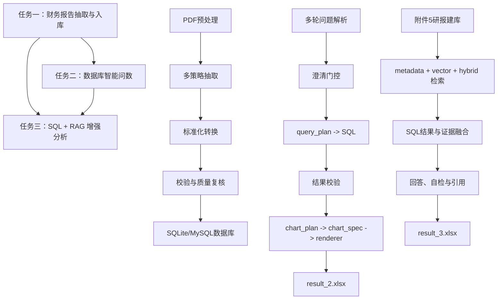
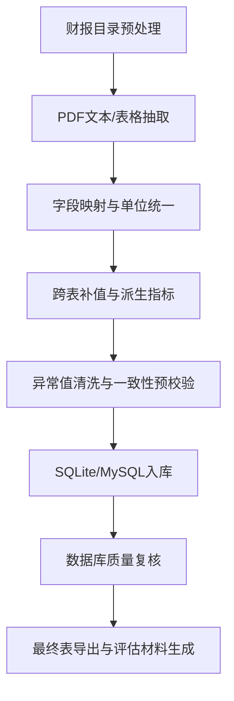
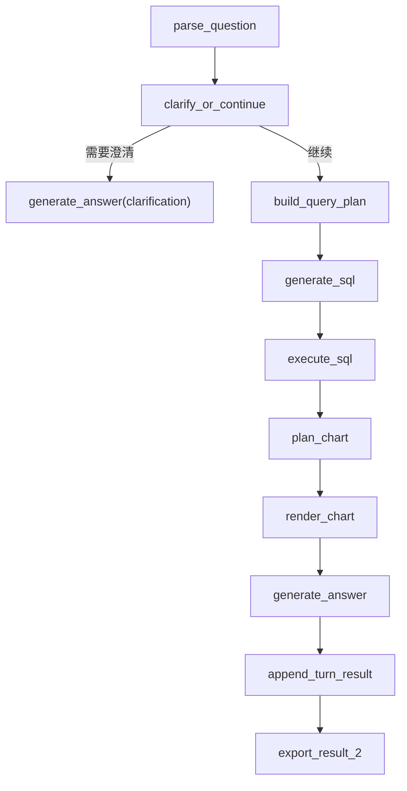
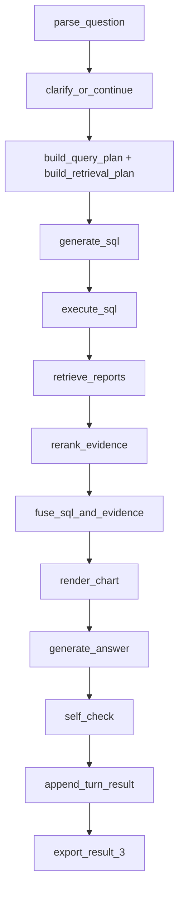

# 基于结构化财务抽取、LangGraph 智能问数与 RAG 增强分析的中药上市公司数据处理与问答系统研究

## 摘要

针对赛题给出的上市公司财务报告、财务问数需求与研报增强分析需求，本文构建了一套由“财务数据抽取入库、数据库智能问数、研报知识增强问答”组成的三阶段解决方案。任务一面向财务报告 PDF，设计了“目录预处理、多策略抽取、字段映射与单位统一、跨表补值、数据库质量复核”的结构化抽取流程，形成后续任务共享的财务数据库。任务二基于任务一数据库，采用 `LangGraph + LLM-only + chart_spec` 的工作流，将多轮问题理解、澄清门控、SQL 生成与修复、结果校验、图表渲染与结果导出组织为显式状态机。任务三进一步在任务二基础上接入附件 5 研报知识库，构建了“PDF 正文抽取、结构化 chunk、`bge-m3` 向量化、FAISS 检索、SQL 与研报证据融合、引用输出、自检”的 `RAG + SQL + LangGraph` 增强分析框架。

在方法实现上，本文针对赛题中的实际难点持续进行了多轮工程化优化，包括字段来源约束、异常值治理、Prompt 调优、cohort 继承、题型路由细分、图表链独立化、检索与 SQL 缓存、`rerank / self_check / rewrite` 触发条件收紧等。结果表明：任务一已形成较稳定的数据底座；任务二框架已基本成型并能够完成批量数据库问数；任务三已从纯骨架推进到可初步提交的可用第一版，完成了知识库构建、图表生成、引用输出与性能收口。整体方案具备较好的模块化、可调试性和可扩展性，为后续进一步提升精度与速度提供了清晰路径。

**关键词：** 财务报告抽取；自然语言转 SQL；LangGraph；RAG；FAISS；图表生成；多轮问答

---

## 1 问题重述与总体技术路线

赛题整体可分为三个逐层递进的任务：

1. **任务一：** 从财务报告 PDF 中抽取四张目标表，并按附件要求完成标准化导出与数据库入库。
2. **任务二：** 基于任务一数据库完成多轮自然语言问数、自动 SQL 生成、结果回答与图表输出。
3. **任务三：** 在任务二数据库问数能力基础上，引入附件 5 研报数据，完成 `SQL + RAG` 融合分析问答。

从系统依赖关系看，任务一决定数据底座质量，任务二决定数据库问数链的稳定性，任务三则在此基础上进一步叠加知识增强与证据引用能力。因此，本文整体采用“**先底座、后问数、再增强**”的三层式技术路线。

整体技术框架如图所示：

---

## 2 任务一：财务报告 PDF 结构化抽取与数据库构建

### 2.1 问题分析

任务一的本质是复杂半结构化文档的信息抽取问题，其主要难点包括：

1. **版式差异大。** 不同交易所、公司和年份的财报在表头命名、分页方式、续表形式和单位表达上差异明显。
2. **报表跨页与拆行严重。** 目标报表常常跨页延续，标题与数值易被分页打断。
3. **字段口径不统一。** 同一指标在不同公司中存在多种自然语言表达，且附件要求按统一 schema 输出。
4. **不仅要抽取，还要入库与校验。** 任务一不是简单识别文本，还需要形成后续任务可直接使用的稳定数据库。

因此，任务一不能依赖单一抽取工具，而必须构建多策略抽取、标准化转换、跨表补值和质量复核一体化流程。

### 2.2 框架设计

任务一整体采用“**预处理 - 抽取 - 转换 - 融合 - 校验 - 入库 - 评估**”的闭环框架。

### 2.3 关键节点设计思路

#### 2.3.1 目录预处理

针对上交所和深交所两类目录结构差异，系统分别设计预处理脚本，统一生成 `manifest.csv/json` 清单，并处理“更正版优先”“摘要/全文区分”等问题，为后续批处理提供稳定输入。

#### 2.3.2 多策略抽取

为提高对不同版式的适应性，本文综合使用：

- `PyMuPDF`
- `pdfplumber`
- `camelot`
- `fitz.combined_text`

其中：
- `PyMuPDF` 和 `pdfplumber` 用于页面和表格抽取；
- `camelot` 作为补充表格抽取方案；
- `fitz.combined_text` 用于文本兜底与续表重建。

这种多策略组合可以在标准表格、非标准表格和文本型披露之间形成互补。

#### 2.3.3 字段映射与单位统一

系统构建字段别名映射词典，将不同披露口径的指标统一映射到附件 3 schema。金额统一处理 `元/万元/亿元`，比例统一处理 `%`、括号负数和百分点等特殊形式。

#### 2.3.4 跨表补值与派生指标

在抽取结果基础上，系统进一步执行跨表融合和派生计算。例如：

- `资产负债率`
- `每股净资产`
- `每股经营现金流`
- `营业总收入环比增长`
- `归母净利润环比增长`

同时，任务一在后期优化中引入了**字段来源约束**，明确区分：
- 直接从 PDF 读取的字段
- 可从其他表复用的字段
- 需要按公式计算的字段

这一点对后续任务二、任务三的口径稳定性非常重要。

#### 2.3.5 数据一致性校验与数据库质量复核

任务一不只做基础完整性校验，还加入了：

- 资产负债平衡预校验
- 现金流勾稽预校验
- 毛利率/净利率/ROE 跨表一致性预校验
- 极端金额/极端比例清洗
- 独立数据库质量复核报告

这些机制的加入，使任务一从“能运行”提升到“有质量约束的数据底座”。

### 2.4 关键优化过程

任务一后期优化主要集中在以下几个方向：

1. **字段缺失补抽与别名扩展**
   - 补充了大量财报中真实出现的字段别名；
   - 对旧口径字段进行安全回填。
2. **按附件 3 明确字段来源**
   - 将直读、复用和推导逻辑落实到代码层。
3. **提取流程优化**
   - 行内混合文本拆分；
   - 过滤附注号、年份号等假数值；
   - 候选表评分与筛选。
4. **异常值治理**
   - 针对任务二、任务三暴露出来的离谱营收、毛利率、净利率和 ROE 回头修任务一。
5. **数据库质量复核**
   - 输出异常字段汇总、异常明细和 Markdown 报告，便于回溯。

### 2.5 结果分析

当前正式数据全量运行结果表明：

- 有效处理报告数：`1235`
- 主记录总数：`3290`
- 四张业务表记录数：
  - `balance_sheet`: `820`
  - `cash_flow_sheet`: `823`
  - `core_performance_indicators_sheet`: `824`
  - `income_sheet`: `823`
- 当前校验结果：`error = 0`
- 当前仅剩 `17` 条 `warning`

整体上，任务一已经能够为任务二和任务三提供可用的数据库底座。

### 2.6 现存边界与改进方向

尽管任务一已基本成型，但仍存在以下边界：

1. `balance_sheet` 横向空缺仍然偏多。
2. 个别异常金额和异常比例更像是提取错位，而非真实财务值。
3. `qoq` 指标虽然已接入推导逻辑，但仍需继续验证非空率和稳定性。

后续改进方向包括：

- 继续提升候选表评分与选择质量；
- 针对少量特殊版式补规则；
- 持续压缩会污染任务二与任务三的异常值。

---

## 3 任务二：基于 LangGraph 的多轮数据库智能问数与图表生成

### 3.1 问题分析

任务二面向附件 4 多轮问题，要求系统能够自动完成：

1. 自然语言理解
2. 财务指标识别
3. SQL 查询生成与修复
4. 中文回答生成
5. 图片输出
6. 最终 `result_2.xlsx` 导出

与普通的单轮 `NL2SQL` 不同，任务二的难点主要在于：

1. **多轮上下文继承。**
   第二轮经常用“这些公司”“其中哪家”等承接上一轮结果。
2. **指标、时间、图表意图表达灵活。**
3. **SQL 即使语法正确，也未必业务正确。**
4. **图表输出不是可选项。**
   题目明确要求绘图时，必须生成并写入路径。

因此，任务二必须是一套工作流系统，而不是一个简单提示词。

### 3.2 框架设计

任务二采用 `LangGraph + LLM-only + chart_spec` 的工作流架构。

### 3.3 核心节点设计

#### 3.3.1 多轮解析与澄清门控

任务二首先通过解析器抽取：

- 公司
- 报告期
- 指标
- 图表意图
- TopN/阈值条件

随后通过澄清门控判断是否缺少关键槽位。后期优化中，任务二不断收紧误澄清问题，重点避免：

- 面向行业或全市场的问题被错误追问具体公司
- 题面已给指标却仍被误判成缺指标

#### 3.3.2 统一宽表视图 `financials_view`

为了避免让模型直接面对多张业务表，系统运行时将任务一的四张表拼成统一宽表 `financials_view`。任务二全部 SQL 都面向这一视图生成，大幅降低了查询复杂度。

#### 3.3.3 SQL 自动修复

任务二为 SQL 设计了“生成 - 执行 - 错误反馈 - 修复”的闭环，典型修复场景包括：

- 记录过少
- 趋势时间点不足
- 报告期格式异常
- 比例尺度异常

#### 3.3.4 图表三层链路

任务二图表不由模型直接控制最终绘图，而是采用：

`chart_plan -> chart_spec -> renderer`

这样既保证了灵活性，也保证了可控和可复现。

### 3.4 关键优化过程

任务二的后期优化主要包括：

1. **多轮 cohort 继承**
   - 第二轮可以复用上一轮公司集合与结果集。
2. **回答完整性检查**
   - 题目要求列字段时，回答必须覆盖关键字段。
3. **图表策略收口**
   - 明确什么时候应退回表格图，什么时候应坚持柱状图/折线图。
4. **Prompt 调优**
   - query plan、SQL 生成、回答生成、图表规划均采用外置 prompt。
5. **结果级异常清洗**
   - 避免脏数据直接进入回答和图片。

### 3.5 结果分析

任务二目前已经完成从旧版脚本式流程到 LangGraph 工作流的迁移，框架层面已经基本成型：

- 多轮问答已接通
- SQL 查询链已接通
- 图表链已接通
- `result_2.xlsx` 正式导出已接通

当前状态更适合定义为：

- **框架已成型**
- **效果正在收口**

### 3.6 现存边界与改进方向

当前主要边界包括：

1. 个别题型的图表表达仍不理想。
2. 少数场景澄清门控仍然存在误判。
3. 任务一数据质量仍会继续污染任务二的排序、均值和图表。
4. 性能优化仍是待办，需要后续集中推进。

因此，任务二后续更适合继续做：

- Prompt 调优
- 图表策略调优
- 澄清门控收口
- 性能治理

而不再适合大规模重构。

---

## 4 任务三：基于 SQL 与 RAG 融合的研报增强分析问答

### 4.1 问题分析

任务三要求在任务二基础上进一步引入附件 5 研报知识，完成增强分析问答。其本质不再是简单数据库问数，而是：

- 财务数据库查询
- 研报知识检索
- 证据融合
- 多轮分析问答
- 引用输出
- 可视化输出

这一任务的主要难点包括：

1. **既要查数据库，又要做知识检索。**
2. **问题类型差异大。**
   包括纯 SQL 题、图表题、归因题、行业开放题、混合题。
3. **需要输出结构化 references。**
4. **题目明确要求绘图时必须出图。**
5. **若直接沿用重链路，运行速度会过慢。**

因此，任务三不仅要搭建 `RAG + SQL` 框架，还必须兼顾可用性、格式约束与性能。

### 4.2 数据准备层设计

任务三的数据准备层已经从规划推进到真实实现，主要包括：

1. **附件 5 元数据接入**
   - `个股_研报信息.xlsx`
   - `行业_研报信息.xlsx`
   - `字段说明.xlsx`
2. **PDF 正文抽取**
   - 使用 `PyMuPDF`
3. **结构化 chunk**
   - 标题/段落优先切分
   - 图表/表格 caption 单独识别
   - 附带 `figure_table_refs`
4. **向量化**
   - 嵌入模型：`BAAI/bge-m3`
5. **向量检索**
   - FAISS `IndexFlatIP`

当前知识库已经完成全量构建：

- `总 chunk = 12856`
- `已建向量索引 chunk = 12856`
- `index_status = ready`

### 4.3 回答主链设计

任务三主链当前为：

### 4.4 题型路由设计

任务三后期的一项关键优化，是不再把所有问题统一按同一种链路处理，而是先做题型路由。

当前已落地的路由类型包括：

- `sql_only`
- `sql_chart`
- `causal_analysis`
- `industry_open_analysis`
- `hybrid_sql_rag`

对应默认行为为：

1. **纯 SQL 题**
   - `needs_sql=true`
   - `needs_retrieval=false`
2. **纯 SQL 图表题**
   - `needs_sql=true`
   - `needs_retrieval=false`
   - 优先走 `SQL -> chart -> answer`
3. **归因题**
   - `needs_sql=true`
   - `needs_retrieval=true`
4. **行业开放题**
   - `needs_retrieval=true`
   - `source_scope=industry`
5. **混合题**
   - SQL 与 retrieval 同时参与

这一优化显著减少了不必要的重链路调用。

### 4.5 retrieval 与 rerank 设计

任务三当前支持三类检索：

- `metadata`
- `vector`
- `hybrid`

在此基础上，`rerank` 当前采用三层策略：

1. 专门 reranker 优先
   - 推荐：`BAAI/bge-reranker-v2-m3`
2. LLM rerank 回退
3. 分数排序兜底

但后期性能优化中，`rerank` 触发条件已被明显收紧：

- 证据数量少时跳过
- 来源单一时跳过
- 纯 SQL/纯图表题跳过
- 单公司同源个股研报的归因题更容易跳过

### 4.6 图表链与输出结构

任务三图表链已经正式接入，且实现已经独立于任务二：

- `src/task3_langgraph/tools/charts.py`
- `src/task3_langgraph/tools/chart_spec.py`

当前规则：

1. 题目明确要求绘图/可视化时，强制尝试生图。
2. 生成图片路径写入 `A.image`。
3. `references.paper_image` 不表示生成图片路径，而表示：
   - 命中的 PDF 图表/表格“编号 + 标题”

当前 `result_3.xlsx` 已收敛为 4 列：

- `编号`
- `问题`
- `SQL 查询语句`
- `回答`

其中 `回答` 内的 `A` 结构为：

- `content`
- `image`
- `references`

`references` 当前只保留：

- `paper_path`
- `text`
- `paper_image`

### 4.7 关键优化过程

任务三后期的关键优化主要包括：

1. **chunk 清洗与图表标号提取**
   - 过滤封面、目录、声明页噪声；
   - 保留 `figure_table_refs`。
2. **检索计划归一化**
   - 解决归因题和行业开放题的空召回问题。
3. **evidence -> companies -> SQL**
   - 把研报识别出的目标公司稳定下沉到 SQL 条件里。
4. **follow-up cohort 继承**
   - 第二轮“依据是什么/你确定吗”类问题可继承上一轮公司集合。
5. **图表链独立化**
   - task3 生图不再依赖 task2 源码。
6. **性能治理**
   - planning 合并
   - SQL 缓存
   - retrieval 缓存
   - rerank fast path
   - self_check fast path
   - rewrite 触发条件收紧

特别是在最慢题 `B2003` 上，单题耗时已从约 `181s` 压到约 `67s`。

### 4.8 结果分析

当前对任务三的判断是：

- **框架已大致搭好**
- **已经达到可初步提交的程度**
- **当前主要工作转为质量与性能收口**

已完成的关键节点包括：

- 数据准备层
- retrieval 层
- rerank 层
- 融合回答层
- 自检层
- 图表层
- 导出层

### 4.9 现存边界与改进方向

当前 task3 仍存在以下边界：

1. 并非所有题都能稳定命中高质量正文引用，少数题仍可能命中封面弱正文。
2. 某些题 `references=[]` 可能并非 bug，而是附件 5 本身没有对应公司研报。
3. 图表链虽已接入，但“题目未要求时是否主动出图”仍可继续调优。
4. 开放分析题和复杂多轮题的全量耗时仍高于简单 SQL 题。

因此，后续优化重点不再是补骨架，而是：

- 全量质量回归
- 引用质量提纯
- 图表策略继续收口
- 性能进一步压缩

---

## 5 综合结果与系统评价

综合三个任务的当前状态，可以将本文系统评价为：

1. **任务一：** 数据底座已基本成型，具备稳定入库和质量复核能力。
2. **任务二：** 数据库问数主链已成型，支持多轮、SQL、图表和正式导出。
3. **任务三：** 增强分析主链已接通，知识库、检索、引用和图表均已进入可用第一版。

因此，从比赛工程角度看，三个任务已经达到“**可以进行初步提交**”的程度；但从追求更高稳定性和更优结果的角度看，仍存在进一步打磨空间。

---

## 6 现存问题与后续改进方向

后续可重点围绕以下方向继续提升：

1. **任务一**
   - 继续提升 `balance_sheet` 空缺治理；
   - 进一步压缩异常值。
2. **任务二**
   - 图表策略继续收口；
   - 性能治理后续单独推进。
3. **任务三**
   - 提升检索命中质量；
   - 继续优化 `references`；
   - 进一步压复杂题耗时；
   - 继续稳定“要求绘图就必须出图”的策略。

---

## 7 结论

本文针对赛题的三个任务，分别构建了面向 PDF 财务报告抽取、数据库智能问数和 RAG 增强分析的系统化解决方案。整体方案的核心特点在于：

1. 以任务一形成高质量结构化数据库底座；
2. 以任务二建立可扩展的 LangGraph 数据库问数工作流；
3. 以任务三将 SQL、研报检索、图表与引用输出统一纳入增强分析框架。

在不断迭代过程中，本文不仅完成了功能搭建，也通过字段来源约束、Prompt 调优、事件型题条件下沉、图表链独立化、以及 `rerank/self_check/rewrite` 触发条件收紧等措施，持续提高了结果正确性、解释性与运行效率。当前系统已经达到初步提交水平，并为后续进一步提升质量与速度保留了清晰的优化路径。
