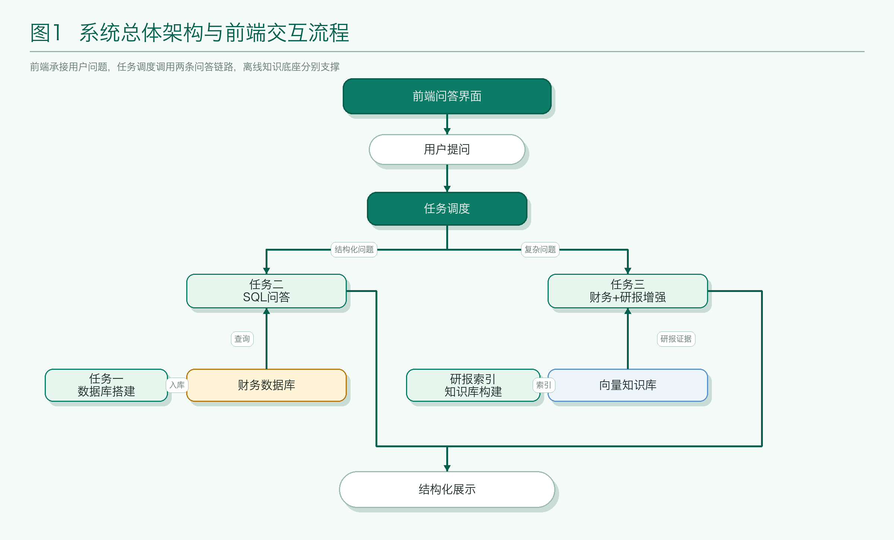
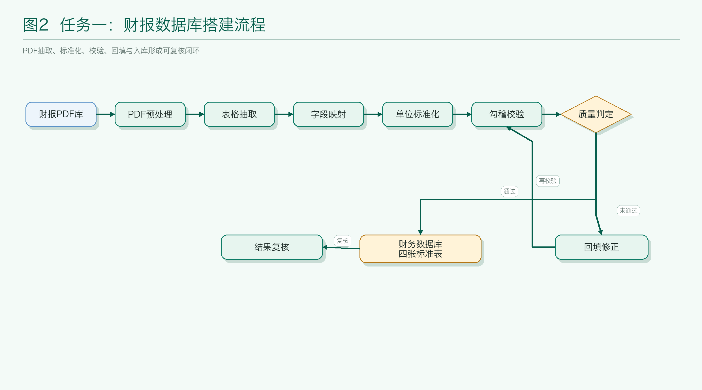
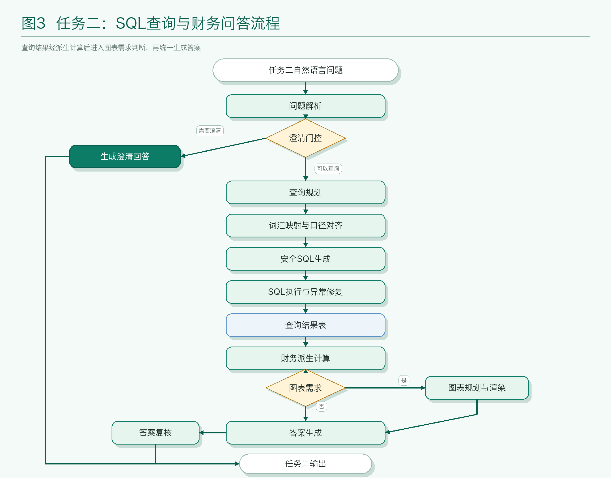
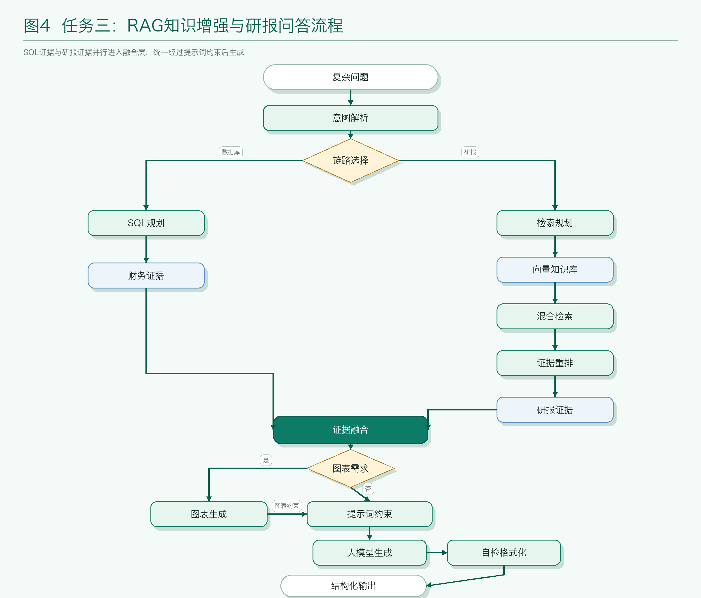
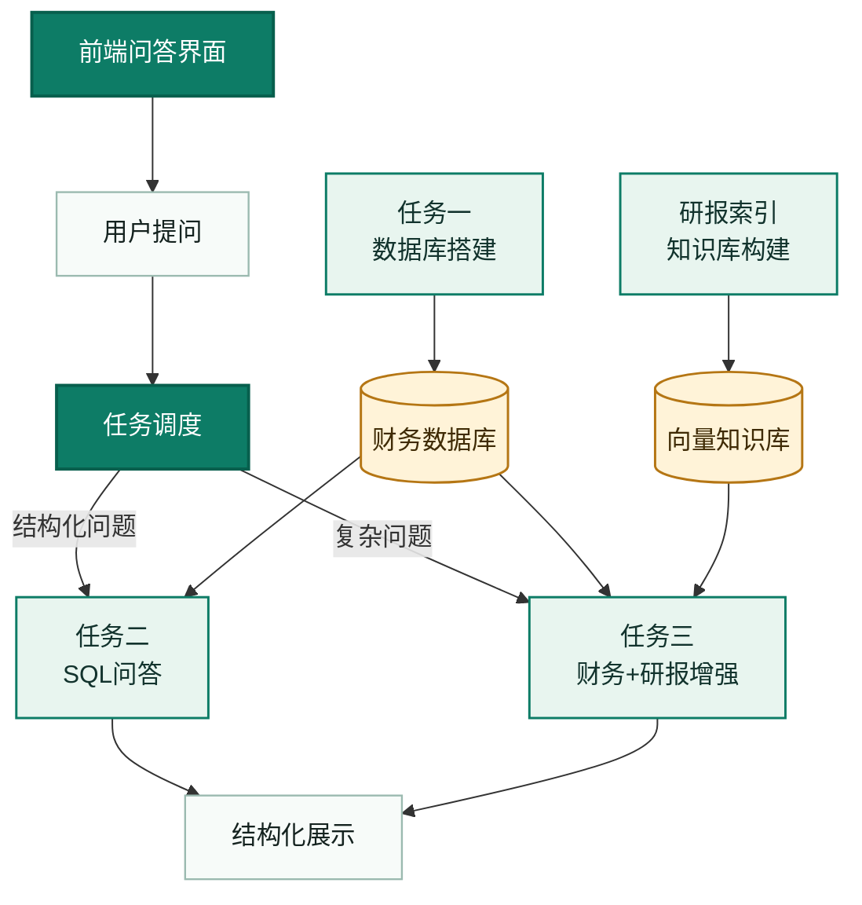
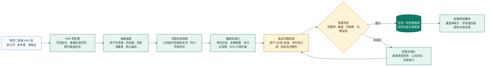
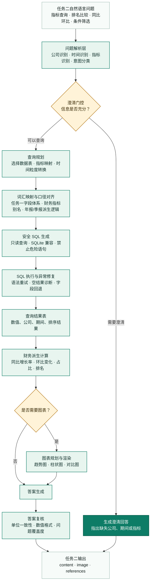
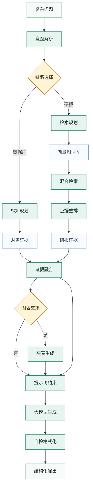

# 论文结构流程图（Mermaid 版）

本文档给出四张可直接放入论文的结构流程图。第一张为系统总览图，展示前端问答界面如何承接用户问题，并在结构化财务数据库和向量知识库之上调度 SQL 查询与 RAG 知识增强模块；后三张分别展开任务一、任务二、任务三的具体求解流程。

## 图片文件

已输出的 PNG 图片位于 `docs/figures/`：

## 图 1  系统总体架构与前端交互流程

**图示说明：** 系统以 Web 前端作为统一交互入口，用户问题进入任务调度层后，按照问题类型分流至 SQL 问答链路或 RAG 知识增强链路。任务一不由在线调度直接触发，而是作为离线建库模块预先形成结构化财务数据库；研报索引模块与其并行形成向量知识库。任务二主要依赖财务数据库完成结构化数值问答，任务三同时接入财务数据库和向量知识库，实现开放性分析、归因解释和引用复核。

## 图 2  任务一：财报数据库搭建流程

**图示说明：** 任务一的核心目标是将非结构化财报 PDF 转换为可计算、可查询、可复核的财务数据库。流程首先通过表格抽取获得原始财务数据，再利用字段别名映射和单位标准化消除不同公司、不同时期披露口径差异。随后通过表内和表间勾稽关系对数据进行质量控制，最终形成覆盖资产负债表、利润表、现金流量表和核心财务指标的结构化数据库。

## 图 3  任务二：SQL 查询与财务问答流程

**图示说明：** 任务二面向结构化财务数据问答，重点在于把自然语言问题转化为安全、准确、兼容 SQLite 的 SQL 查询。系统首先识别公司、期间和指标，并在信息不足时触发澄清门控；若条件充分，则进行查询规划和 SQL 生成。查询结果经过同比、环比、排名等派生计算后，由答案生成模块组织为自然语言回答，并根据问题需求生成图表。

## 图 4  任务三：RAG 知识增强与研报问答流程

**图示说明：** 任务三是在结构化数据库和非结构化研报知识库之上构建的检索增强问答流程。系统根据问题意图动态选择 SQL 查询链路和研报检索链路：前者提供可计算的财务事实，后者提供行业解释、政策背景和图表依据。两类证据经融合后进入分层提示词模板，由大模型生成最终回答，并通过自检模块保证输出字段和引用结构满足提交要求。
